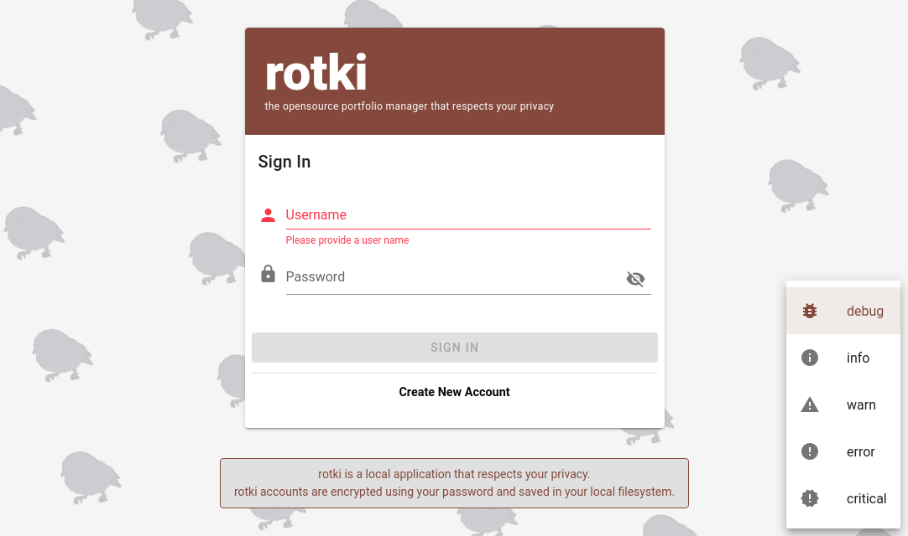
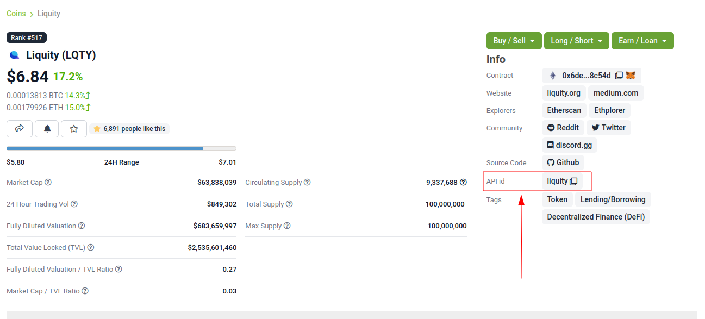
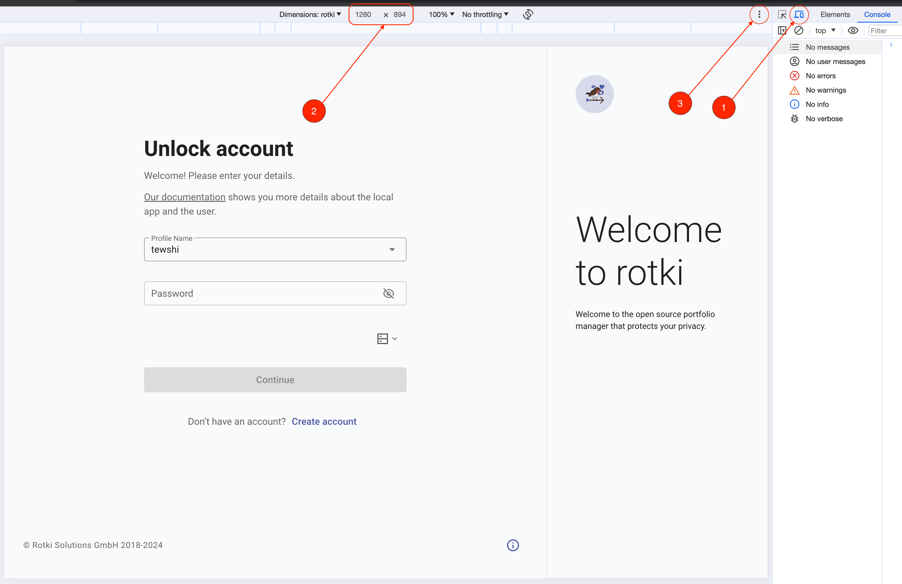
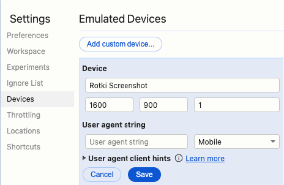
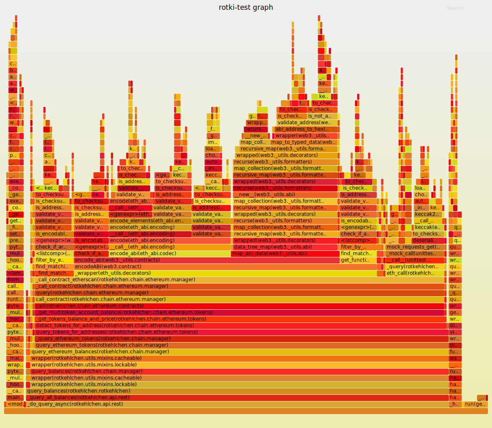

rotki Contribution Guide
##############################

rotki is an opensource project so help is really appreciated.

.. _bug_reporting:

Bug Reporting
*****************

Before reporting an issue, make sure to check the issue tracker for similar ones. If this is a new issue then use the `proper template <https://github.com/rotki/rotki/issues/new?template=bug_report.md>`_ providing a detailed description about:

- **Problem**: what happened and what you were expecting to happen instead.
- **Logs**: run rotki in debug mode, replicate the issue and attach the logs (see the section `Run rotki in debug mode <#run-rotki-in-debug-mode>`_).
- **Environment**: the operating system and the rotki version.

Run rotki in debug mode
=========================

For running rotki in debug mode, you can do it either via a config file or the app UI:

- **Config file**: see the section :ref:`set-the-backend-s-arguments`.
- **App UI**: before log in, click the cog wheel at the bottom right corner and select "Debug" (image below). Press the save button and proceed to log in as usual.

You can open the app logs location by going to "Help" menu at the top and then choosing "Logs Directory".

The default log locations are:

- **Linux**: ``~/.config/rotki/logs``
- **OSX**: ``~/Library/Application Support/rotki/logs``
- **Windows**: ``%APPDATA%\rotki\logs``

Feature Requests
******************

Use the `feature request <https://github.com/rotki/rotki/issues/new?template=feature_request.md>`_ template.

Describe exactly what it is that you would like to see added to rotki and why that would provide additional value.

Please note that feature requests are just that. Requests. There is no guarantee that they will be worked on in the near future.

Contributing as a Developer
*****************************

Being an opensource project, we welcome contributions in the form of source code. To do that you will have to work on an issue and open a Pull Request for it.

In order for your Pull Request to be considered it will need to pass the automated CI tests and you will also need to sign the CLA (Contributor's license agreement).

Committing Rules
==================

For an exhaustive guide read `this <http://chris.beams.io/posts/git-commit/>`_ guide. It's all really good advice. Some rules that you should always follow though are:

1. Commits should be just to the point, not too long and not too short.
2. Commit title not exceed 50 characters.
3. Give a description of what the commit does in a short title. If more information is needed then add a blank line and afterward elaborate with as much information as needed.
4. Commits should do one thing, if two commits both do the same thing, that's a good sign they should be combined.
5. **Never** merge master on the branch, always rebase on master. To delete/amend/edit/combine commits follow `this tutorial <https://robots.thoughtbot.com/git-interactive-rebase-squash-amend-rewriting-history>`_.

When pushing on a PR the tags ``[skip ci]`` or ``[ci skip]`` can be used a part of the commit message to skip the run of all the CI jobs (lint, test etc).

Linting / Formatting
=======================

Make sure to run ``make lint`` before pushing your commit. This runs isort, flake8, mypy and pylint on the code to make sure that formatting rules and common mistakes are not committed in the code.

Set your editor up to use isort as seen in the Makefile (format command) before saving each file.

You can also bulk apply formatting changes to all files by running ``make format``

Where to make changes
============================

- If you want to contribute fixing a bug use the `bugfixes <https://github.com/rotki/rotki/tree/bugfixes>`_ branch.
- To add new assets also use the `bugfixes <https://github.com/rotki/rotki/tree/bugfixes>`_ branch.
- Any other change can be made against the `develop <https://github.com/rotki/rotki/tree/develop>`_ branch.

Our releases work like this:

- We release patches merging the `bugfixes` branch to master and adding a new tag.
- Normal releases are created by merging the `develop` branch to master and adding a new tag.

Adding new assets to rotki
============================

To add new assets for rotki you will have to edit `the SQL file <https://github.com/rotki/assets/tree/develop/updates>`__
in the last update at the assets repository. SQL sentences for insertion differ depending on if we are adding an ethereum token
or other types of assets. More information about each type of asset and columns is available at the 
`readme file <https://github.com/rotki/assets#adding-ethereum-tokens>`__.

Once you have finished adding assets it would be necessary to update the file containing metadata about the update. To do so run the script:

::

    python tools/populate_infojson.py

This will update the file `info.json`. Finally execute the tests to detect possible errors in the SQL sentences using:

::

    pytest tests

In order to do so you will need to install the dependencies in the `requirements.txt` file.

.. _get_coingecko_asset_identifier:

Get CoinGecko asset identifier
--------------------------------

In most cases the CoinGecko asset identifier matches the URL one, for example "weth" for `WETH <https://www.coingecko.com/en/coins/weth>`__. However, sometimes it doesn't, for example "sharering" for `SHR <https://www.coingecko.com/en/coins/sharetoken>`__ ("sharetoken" in the URL).
Lately coingecko added the API id of the asset to the information provided for the asset.

This identifiers mismatch can be detected by running the `this test <https://github.com/rotki/rotki/blob/develop/rotkehlchen/tests/unit/test_assets.py#L91>`__:

::

    python pytestgeventwrapper.py -xs rotkehlchen/tests/unit/test_assets.py::test_coingecko_identifiers_are_reachable

The test warns each mismatch suggesting the potential identifier (e.g. *Suggestion: id:sharering name:ShareToken symbol:shr*). This identifier can be checked via the **GET coins by id endpoint** on the `CryptoCompare API explorer <https://www.coingecko.com/en/api#explore-api>`__.

The test also warns about any asset delisted from CoinGecko. In that case, add the delisted asset identifier in the `coins_delisted_from_coingecko list <https://github.com/rotki/rotki/blob/80893e93a9b2e74287a5949c5fb742b5a068cecc/rotkehlchen/tests/unit/test_assets.py#L72>`__.

.. _get_cryptocompare_asset_identifier:

Get CryptoCompare asset identifier
------------------------------------

One important gotcha is to check for CryptoCompare asset prices. Unfortunately you need to to check the page of each asset in CryptoCompare. For example for `$BASED <https://www.cryptocompare.com/coins/based/overview>`__ you would need to check the page and then try to see the api call for USD price to see `if it exists <https://min-api.cryptocompare.com/data/pricehistorical?fsym=$BASED&tsyms=USD&ts=1611915600>`__. If this returns something like:

::

   {"Response":"Error","Message":"There is no data for any of the toSymbols USD .","HasWarning":true,"Type":2,"RateLimit":{},"Data":{},"Warning":"There is no data for the toSymbol/s USD ","ParamWithError":"tsyms"}

Then that means you have to check the CryptoCompare page and compare directly with the asset they have listed there. Like `so <https://min-api.cryptocompare.com/data/pricehistorical?fsym=$BASED&tsyms=WETH&ts=1611915600>`__ and see that it works. Then you need to edit the CryptoCompare mappings in the code to add that special mapping `here <https://github.com/rotki/rotki/blob/239552b843cd8ad99d02855ff95393d6032dbc57/rotkehlchen/externalapis/cryptocompare.py#L45>`__.
If you don't find your asset on CryptoCompare just put an empty string for the cryptocompare key. Like ``cryptocompare: ""``.

Hopefully this situation with CryptoCompare is temporary and they will remove the need for these special mappings soon.

.. _helpful_asset_commands:

Helpful commands
------------------------------------

- To get the checksummed ethereum address, you can get from the Python console using our code simply by doing::

    >>> from eth_utils.address import to_checksum_address
    >>> to_checksum_address("0x9c78ee466d6cb57a4d01fd887d2b5dfb2d46288f")
    '0x9C78EE466D6Cb57A4d01Fd887D2b5dFb2D46288f'

Adding new Centralized Exchanges (CEXes)
============================================

All centralized exchanges modules live in a separate python file under `here <https://github.com/rotki/rotki/tree/develop/rotkehlchen/exchanges>`__.

As an example of how to add a new CEX you can check the `Bitpanda PR <https://github.com/rotki/rotki/pull/3696/files>`__.

Add Location
-----------------

You should add a new value to the `location Enum <https://github.com/rotki/rotki/blob/1039e04304cc034a57060757a1a8ae88b3c51806/rotkehlchen/types.py#L387>`__ and also make sure that the value is mirrored in the DB's schema as seen `here <https://github.com/rotki/rotki/blob/1039e04304cc034a57060757a1a8ae88b3c51806/rotkehlchen/db/schema.py#L93-L94>`__. Add it also in the ``SUPPORTED_EXCHANGES`` list `here <https://github.com/rotki/rotki/blob/1039e04304cc034a57060757a1a8ae88b3c51806/rotkehlchen/exchanges/manager.py#L31>`__. Finally don't forget to add it in the latest DB upgrade as seen in the Bitpanda PR linked in the start of this section.

Create exchange module
--------------------------

To add a new CEX you should create a new file with the name of the exchange all lowercase in `here <https://github.com/rotki/rotki/tree/develop/rotkehlchen/exchanges>`__.

It should have a class which should be the exact same name as the file but with the first letter capitalized. So if the module name is ``pinkunicorn.py`` the class name should be ``Pinkunicorn``.

That class should inherit from the ``ExchangeInterface`` and implement all the required methods.

It should have an ``edit_exchange_credentials()`` and ``validate_api_key()`` to be able to validate and accept new credentials.

It should have a ``query_balances()`` to return the current balances of the user in the exchange.

It should have a ``query_online_trade_history()`` to query the trade history endpoint of the exchange for a given time range and save them in the database.

It should have a ``query_online_deposits_withdrawals()`` to query the deposit/withdrawals history endpoint of the exchange for a given time range and save them in the database.

Optionally it can have a ``query_online_income_loss_expense`` to parse any special data from the exchange that can create income/loss items for the user such as staking events.

Add Asset Mappings
-------------------

Exchanges have assets listed by symbols. This is unfortunately inaccurate and has conflicts since there is no central crypto registry and there is way too many crypto assets using the same symbol.

We tackle this by having special mapping such as this one `here <https://github.com/rotki/rotki/blob/1039e04304cc034a57060757a1a8ae88b3c51806/rotkehlchen/assets/asset.py#L501>`__. So you would add the mapping ``WORLD_TO_MYNEWEXCHANGE``. Then you would create an ``asset_from_mynewexchange()`` function like `this one <https://github.com/rotki/rotki/blob/1039e04304cc034a57060757a1a8ae88b3c51806/rotkehlchen/assets/converters.py#L885-L898>`__ for bittrex.

To find any assets listed in the exchange that are not mapped perfectly you would need to find and call the endpoint of the exchange that queries all assets. Then you need to write a test like `this <https://github.com/rotki/rotki/blob/1039e04304cc034a57060757a1a8ae88b3c51806/rotkehlchen/tests/exchanges/test_bittrex.py#L37-L51>`__ which queries all assets and tries to call the ``asset_from_bittrex()`` function. If any asset is not mapped properly a warning should be raised so we the developers figure out a new asset is added and we need to map it.

Add tests for the exchange
-----------------------------

You should write tests for all the endpoints of the exchange you implemented. To see what tests and how to write them check the bitpanda PR linked in the start of this section.

You will generally need to:

- Touch ``rotkehlchen/tests/api/test_exchanges.py::pytest_setup_exchange()``
- Add a new test module under ``rotkehlchen/tests/exchanges/``
- Add a new fixture for the exchange at ``rotkehlchen/tests/fixtures/exchanges/mynewexchange.py`` and expose it in ``rotkehlchen/tests/fixtures/__init__.py``

Adding new ethereum modules
===================================

This guide is to explain how to add a new ethereum module into rotki and its corresponding transaction decoder and accountant.

Add new module directory
--------------------------

Each ethereum modules lives in `this <https://github.com/rotki/rotki/tree/develop/rotkehlchen/chain/ethereum/modules>`__ directory. To add a new module you should make sure the name is unique and create a new directory underneath.

The directory should contain the following structure::

  |
  |--- __init__.py
  |--- decoder.py
  |--- constants.py
  |--- accountant.py

Almost all of the above are optional.

The decoder
--------------

As an example decoder we can look at `makerdao <https://github.com/rotki/rotki/blob/1039e04304cc034a57060757a1a8ae88b3c51806/rotkehlchen/chain/ethereum/modules/makerdao/decoder.py>`__.

It needs to contain a class that inherits from the ``DecoderInterface`` and is named as ``ModulenameDecoder``.

Counterparties
^^^^^^^^^^^^^^^^

It needs to implement a method called ``counterparties()`` which returns a list of counterparties that can be associated with the transactions of this modules. Most of the times these are protocol names. Like ``uniswap-v1``, ``makerdao_dsr`` etc.

These are defined in the ``constants.py`` file.

Mappings and rules
^^^^^^^^^^^^^^^^^^^

The ``addresses_to_decoders()`` method maps any contract addresses that are identified in the transaction with the specific decoding function that can decode it. This is optional.

The ``decoding_rules()`` defines any functions that should simply be used for all decoding so long as this module is active. This is optional.

The ``enricher_rules()`` defies any functions that would be used for as long as this module is active to analyze already existing decoded events and enrich them with extra information we can decode thanks to this module. This is optional.

Decoding explained
^^^^^^^^^^^^^^^^^^

In very simple terms the way the decoding works is that we go through all the transactions of the user and we apply all decoders to each transaction event that touches a tracked address. First decoder that matches, creates a decoded event.

The event creation consists of creating a ``HistoryBaseEntry``. These are the most basic form of events in rotki and are used everywhere. The fields as far as decoded transactions are concerned are explained below:

- ``event_identifier`` is always the transaction hash. This identifies history events in the same transaction.
- ``sequence_index`` is the order of the event in the transaction. Many times this is the log index, but decoders tend to play with this to make events appear in a specific way.
- ``asset`` is the asset involved in the event.
- ``balance`` is the balance of the involved asset.
- ``timestamp`` is the unix timestamp **in milliseconds**.
- ``location`` is the location. Almost always ``Location.BLOCKCHAIN`` unless we got a specific location for the protocol of the transaction.
- ``location_label`` is the initiator of the transaction.
- ``notes`` is the human readable description to be seen by the user for the transaction.
- ``event_type`` is the main type of the event. (see next section)
- ``event_subtype`` is the subtype of the event. (see next section)
- ``counterparty`` is the counterparty/target of the transaction. For transactions that interact with protocols we tend to use the ``CPT_XXX`` constants here.

Event type/subtype and counterparty
^^^^^^^^^^^^^^^^^^^^^^^^^^^^^^^^^^^^^^

Each combination of event type and subtype and counterparty creates a new unique event type. This is important as they are all treated differently in many parts of rotki, including the accounting. But most importantly this is what determines how they appear in the UI!

The place where the UI mappings happen is `frontend/app/src/store/history/consts.ts <https://github.com/rotki/rotki/blob/1039e04304cc034a57060757a1a8ae88b3c51806/frontend/app/src/store/history/consts.ts>`__.

The Accountant
-----------------

As an example accountant module we can look at `makerdao <https://github.com/rotki/rotki/blob/1039e04304cc034a57060757a1a8ae88b3c51806/rotkehlchen/chain/ethereum/modules/makerdao/accountant.py>`__.

The ``accountant.py`` is optional but if existing should also be under the main directory. It should contain a class named ``ModuleNameAccountant`` and it should inherit the ``ModuleAccountantInterface``.

What this class does is to map all the different decoded events to how they should be processed for accounting.

These accountants are all loaded in during PnL reporting.

Each accountant should implement the ``reset()`` method to reset its internal state between runs.

Event Settings mapping
^^^^^^^^^^^^^^^^^^^^^^^

Each accountant should implement the ``event_settings()`` method. That is a mapping between each unique decoded event type, identified by ``get_tx_event_type_identifier()`` and its ``TxEventSettings()``.

So essentially determining whether:

- ``taxable``: It's taxable
- ``count_entire_amount_spend``: If it's a spending event if the entire amount should be counted as a spend which means an expense. Negative PnL.
- ``count_cost_basis_pnl``: If true then we also count any profit/loss the asset may have had compared to when it was acquired.
- ``take``: The number of events to take for processing together. This is useful for swaps, to identify we need to process multiple events together.
- ``method``: Either an ``'acquisition'`` or a ``'spend'``.
- ``multitake_treatment``: Optional. If ``take`` is not ``1``, then this defines how we treat it. It's always a swap for now, so ``TxMultitakeTreatment``.
- ``accountant_cb``: Optional. A callback to a method of the specific module's accountant that will execute some extra module-specific pnl processing logic. The makerdao accountant linked above has some examples for this.

Multiple submodules
--------------------

The modules system is hierachical and one module may contain multiple submodules. For example uniswap having both v1 and v3 each in their own subdirectories as seen `here <https://github.com/rotki/rotki/tree/develop/rotkehlchen/chain/ethereum/modules/uniswap>`__.

Code Testing
**************

Python
========

In order to run the python test suite, first make sure the virtual environment is activated, the developer requirements are installed, and then do:

::

    python pytestgeventwrapper.py -xs rotkehlchen/tests

We require this wrapper as a drop-in replacement of pytest due to quirks of gevent and monkeypatching.

For running the tests with a more specific usage and invocation, please refer to the `pytest <https://docs.pytest.org/en/stable/usage.html>`__ documentation.

Linting
--------

Before each commit you should run the linting checks. They run ``flake8``, ``mypy`` and ``pylint`` in order.

Do that by invoking ``make lint`` from the root directory of the project.

Alternative Linting and Static Analysis Tools
----------------------------------------------

There is some alternative linting tools that we don't run in the CI since they have a lot of false positives. It's good to run them from time to time so they are listed here.

 - **vulture**: Source and docs `here <https://github.com/jendrikseipp/vulture>`__. Just get via ``pip install vulture``. If you simply run it from the root directory you will get a list of possibly unused code that you can remove. You will have to go through a lot of false positives.
 - **bandit** Source and docs `here <https://github.com/PyCQA/bandit>`__. Just get via ``pip install bandit``. If you run it you will get a lot of potential issues in the code. You will have to go through a lot of false positives.

Manual Testing
***********************

In order to make sure that the final executable works as a complete package (including the UI) a bit of manual testing with the final binaries is required.

This should eventually be reduced when we manage to have a more complete E2E test suite. Everything below that can be E2E tested should be.

If time allows test the below on the binaries for all OSes. If not just on one.

Startup
=========

New User
----------

- Create a new user and see that it works. Both with and without a premium key. With a premium key make sure that you can verify that pulling data from the server works.

- Provide mismatching passwords and see it's handled properly.

- Provide wrong premium keys and see it's handled properly

Sign in existing user
----------------------

- Sign in an existing user with a wrong password and see it's handled.

- Sign in a non-existing user and see it's handled

- Sing in an existing user and see it works

External Trades
================

- Add an external trade and see it's added in the table
- Edit an external trade from the table and see it's altered
- Delete an external trade from the table and see it's removed
- Expand the details on a trade and see they are shown properly

Data Importing
===============

- Import some data from cointracking.info and see that works properly

Exchanges
===========

- Add an invalid exchange API key and see it's handled properly
- Add a valid exchange API key and see it works. See that dashboard balances are also updated.
- Remove an exchange and see that it works and that the dasboard balances are updated.

External Services
==================

- Add an API key for all external services
- Remove an API key for all external services

Application and Accounting Settings
====================================

- Change all application settings one by one and see the changes are reflected.
- Same as above but for invalid values (if possible) and see they are handled.
- Change the profit currency and see it works
- Change all accounting settings one by one and see the changes are reflected.
- Same as above but for invalid values (if possible) and see they are handled.

Accounts and Balances
========================

Fiat
-----

- Add a fiat balance and see it works
- Remove a fiat balance and see it works
- See that adding non number or negative is handled

Ethereum Accounts
-------------------

- Add an ethereum account and see it works
- Add an invalid ethereum account and see it is handled properly
- Remove an ethereum account and see it works
- After adding tokens to an account that has it expand the account and see all tokens owned by it are shown.

Ethereum Tokens
-------------------

- Track an ethereum token and see it works. Works is defined as being added:
    - In the dashboard
    - In the owned tokens
    - In total blockchain balances
    - In the expanded asset details of ETH accounts that own it.
- Remove an ethereum token and see it works. Works means being removed from all the above.

Bitcoin accounts
----------------

- Add a bitcoin account and see it works
- Add an invalid bitcoin account and see it is handled properly
- Remove a bitcoin account and see it works

Tax Report
===========

- Check that invalid input in the date range are handled properly
- Create a big tax report over many exchanges for a long period of time and see that it's correct and no unexpected problems occur.
- Create a CSV export of the report and see it works

Premium Analytics
===================

- Check they work for a premium account
- Modify the range of the netvalue graph and see it works properly
- Change the asset and modify the range of the graph of amount and value of an asset and see it works properly
- Check the netvalue distribution by location works properly
- Check the netvalue distribution by asset works properly and that you can modify the number of assets shown in the graph

Updating the documentation
==========================

rotki is continuously changing and sometimes documentation gets outdated. One way to contribute to rotki is by helping to keep the documentation up to date. To do so you have to edit the corresponding section in the .rst files inside the docs folder of the git repo. 

To review your changes you can compile the documentation using the command 

::

    make html

inside the docs folder.

Guide Screenshots
------------------

When updating the user guide documentation you might need to update the application screenshots.

In order to be consistent, you can use the chrome developer tools in the electron application to
capture the screenshots.

First you have to toggle the device toolbar (1).

If this is the first time you are taking a screenshot, click on the **Dimensions** dropdown menu and
select edit (2).

There you will be given the option to **Add custom device**. Use the following settings:

- **Resolution**: 1280x894
- **DPR**: 1.3

In the user agent make sure that **Desktop** is selected. Then proceed to save the entry.

After making sure that this entry is selected, you can press the overflow menu (3) and select the
**Capture Screenshot** entry to capture a new screenshot.

Code profiling
*********************

Python
===========

Flamegraph profiling
------------------------

In order to use the flamegraph profiler you need to:

1. pip install -r requirements_profiling.txt to make sure you have the latest dependencies required for profiling
2. Install the `flamegraph <https://github.com/brendangregg/FlameGraph>`_ package in your system. Some OSes such as Archlinux have `ready-made packages <https://aur.archlinux.org/packages/flamegraph/>`_.

Then in order to profile a test run all you need to do is add ``--profiler=flamegraph-trace`` to the pytest arguments.

Once the test concludes this will add a data file under ``/tmp`` with the data generated by the run. Example: ``/tmp/20211127_1641_stack.data``

Then you can run the flamegraph tool on that data to generate an svg. Example:

``flamegraph.pl --title "rotki-test graph" /tmp/20211127_1641_stack.data > profile.svg``

Finally open the svg with any compatible viewer and explore the flamegraph. It will look like this:

Docker publishing (manual)
*****************************

If a need exists to publish on hub.docker.com then the following steps need to be followed.

.. note::

    Make sure that you are logged with an account that has access to publish to docker.

This installs the qemu binaries required to build the arm64 binary and uses buildx to build the images.
Please replace the the ``REVISION`` with the git sha of the tag and the ``ROTKI_VERSION`` with the
tag name.

.. code-block::

    docker pull tonistiigi/binfmt:latest
    docker run --rm --privileged tonistiigi/binfmt:latest --install arm64
    docker buildx create --name imgbldr --use
    docker buildx inspect --bootstrap --builder imgbldr
    docker buildx build --build-arg REVISION='git sha' --build-arg ROTKI_VERSION=vx.x.x --file ./Dockerfile --platform linux/amd64 --platform linux/arm64 --tag rotki/rotki:vx.x.x --tag rotki/rotki:latest --push .
