Rotki Usage Guide
#####################
.. toctree::
  :maxdepth: 2

Introduction
*************

In this section we are going to see how to use various parts of the Rotki application.

First time sign-up
====================

When you start Rotki you are greeted with a sign-in/signup prompt.

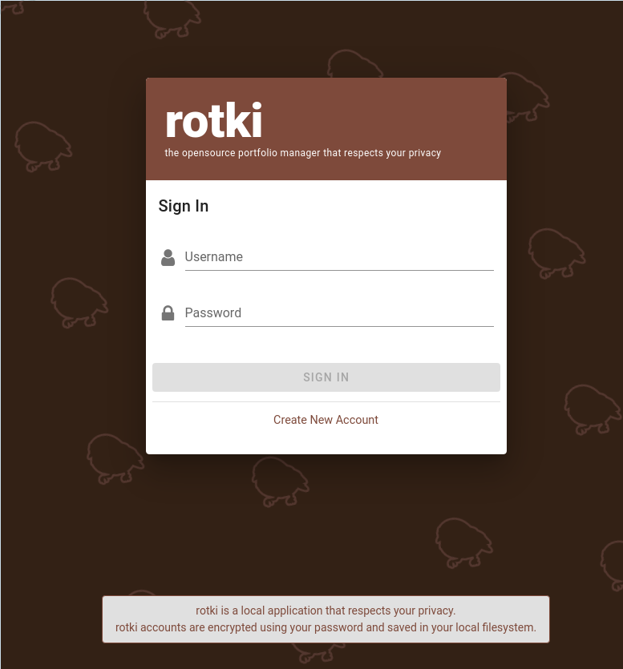

.. role:: red

For creating an account press "Create New Account" and provide a username and a password:

  - **Username**: it is just an identifier for your database; a local user.
  - **Password**: :red:`Do not forget this password`. It is used to encrypt all your local files.

If you have purchased a premium subscription you can also add the **API Key** and the **secret** here. See the section :ref:`sync-data-with-rotki-server` to know how to sync your data with Roki Server (this option is disabled by default).

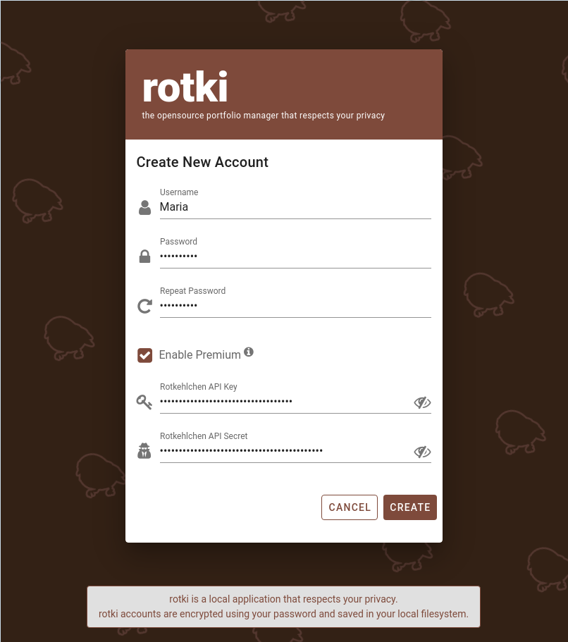

All accounts are created in the rotki directory, see the section :ref:`rotki_data_directory` to know where it is located.

Create a new account that restores a backed up database (premium user only)
=============================================================================

If you have a premium subscription and you want to create a new local account that restores the backed up database, for example in a different device, you must add the **API key/secret** and :red:`use the same password`. If the password is not the same, opening the database will fail.

.. image:: images/rotki_premium_signup_failed.png
   :alt: Sign-up with existing premium subscription using a wrong password
   :align: center

See the section :ref:`sync-data-with-rotki-server` to know more about how the premium subscription will behave with multiple accounts/devices and how to sync your data with Roki Server (this option is disabled by default).

Sign-in
=========

If you already have an account just write the name and the password at the sign in prompt.

Set up Rotki Premium
======================

If you decide to purchase `Rotki Premium <https://rotki.com/products/>`_ at a later time, you can set it up via API Keys -> Rotki Premium.

.. image:: images/rotki_premium_set.png
   :alt: Set up Rotki premium API key/secret pair in an existing account
   :align: center

If after you have set up premium you wish to replace or disassociate keys with the currently logged-in account, you can do so via the same page.

.. image:: images/rotki_premium_del.png
   :alt: Delete up Rotki premium API key/secret pair in a premium account
   :align: center

.. _sync-data-with-rotki-server:

Sync data with Rotki Server
-----------------------------

To back up your data in the Rotki Server switch on "Allow data sync with Rotki Server". This allows you to restore it later on in any account/device as long as :red:`the same API Key/secret and account password are used`.

.. image:: images/rotki_premium_set_sync_data.png
   :alt: Sync data with Rotki Server
   :align: center

Bear in mind that in case of using multiple accounts/devices with the data sync enabled, the one with the most recent login will upload the most up-to-date data to Rotki Server. After that, using the same account from another device may ask you whether you want to replace your local database with the remote one.

.. image:: images/rotki_premium_replace_local_db_with_remote.png
   :alt: Replace local database with remote backup
   :align: center

Customizing
**************

This section contains information about how to customize the application through the settings. By clicking on the user icon on the top right and choosing settings you can customize some basic settings for the application.

.. _change_profit_currency:

Changing the Profit Currency
=============================

Rotki calculates everything, including your total profit/loss during the PnL report into a given fiat currency. This is what we call the ``profit_currency``. By default this is USD. You can easily change this setting by clicking on the currency icon the top right menu and changing it to the currency you are using.

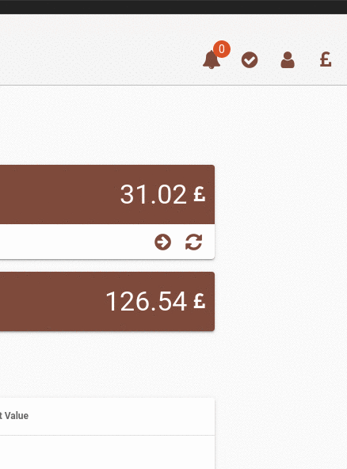

Customizing the application settings
====================================

By choosing the "General" settings button you can customize some general application settings.

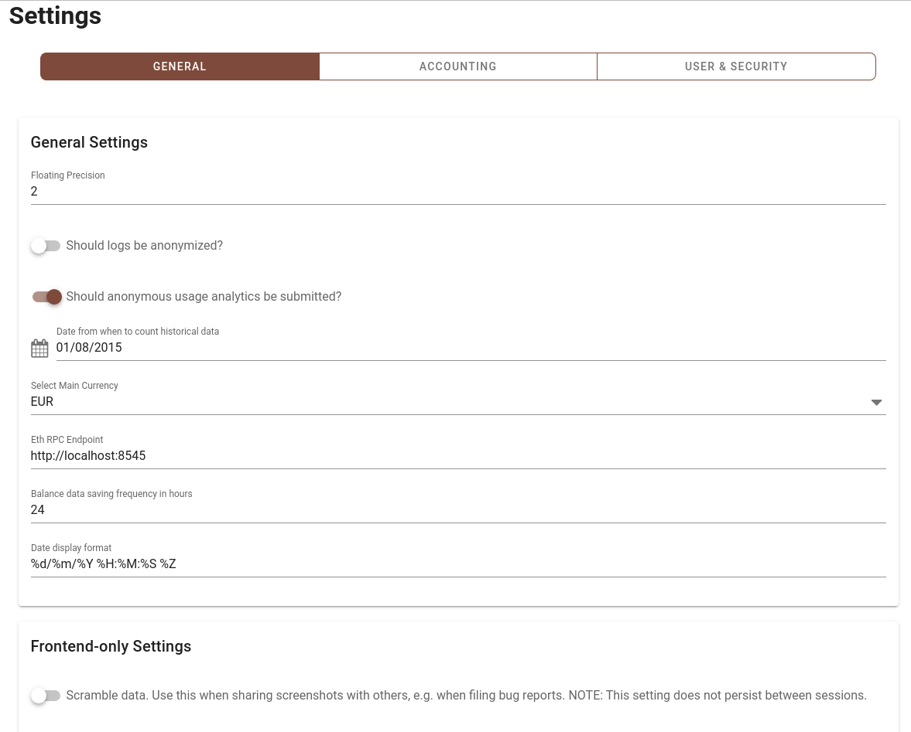

Floating precision
--------------------

Set how many decimal points should be shown in the UI for floating point numbers.

Anonymized logs
------------------

Specify whether logging functionality should be anonymized. That has a small cost in performance but makes sure that all logs that would otherwise contain sensitive tradeinformation have them anonymized with random values.

Anonymous usage analytics
-------------------------------

Specify whether the application is allowed to submit anonymous usage analytics. As a local application Rotki has no other way to measure how many active users it has other than submitting some form of analytics. The data that are submitted are completely anonymized and contain no sensitive information.

Date from when to count historical data
-----------------------------------------

A date before which historical data is not counted.

Main currency
----------------

Same as `changing the profit currency <change_profit_currency_>`_.

Connecting to an Ethereum Client
------------------------------------

When Rotki begins it tries to connect to a local ethereum node running with an rpc port set at the default port ``8545``. If no client is running then all blockchain queries will use an external service such as etherscan and this will be rather slower.

If you want to connect to another ethereum client you can set the URL and port through the settings. Click the person icon on the top right menu and select "Settings" from the drop down menu. This will take you to the settings page. Write the desired url/port in the ETH RPC endpoing textbox.

Balance data saving frequency
---------------------------------

Set how often (in hours) the data of all balances will be saved. This data is used to calculate statistics and other historical data to show to the user.

Date display format
---------------------

Set the display format of the dates in the Rotki user interface.

Customizing the accounting settings
====================================

By choosing the "Accounting" settings button you can customize some application settings that pertain to accounting calculations.

You should understand what each setting does, consult with a tax accountant for your jurisdiction and then set them appropriately.

The default settings are at the moment set for the German tax jurisdiction. For example all profit/loss calculation is done for trades on a first-in/first-out basis and profits from selling crypto assets after 1 year are non taxable. These settings can be adjusted.

.. image:: images/sc_accounting_settings.png
   :alt: Customizing the accounting settings
   :align: center

Crypto to crypto trades
------------------------

Specify whether crypto to crypto trades are taxable and should be taken into account. If yes then each crypto to crypto trade also creates a "virtual" trade that sells or buys the crypto asset for fiat and then sells or buys the fiat for the other crypto asset.

Ethereum gas costs
---------------------

Specify whether ethereum transaction gas costs should be counted as loss. If this is set then all ETH spent on gas will be deducted from your profits and count as an expense.

Tax free period
-------------------

Specify whether there is a period of time and if yes how many days, after which holding a crypto asset is considered not taxable.

Ignored assets
-----------------

Specify which assets you own and would like to completely ignore from all calculations. Any actions that involve these assets are ignored.

Customizing data & security settings
====================================

Changing password
---------------------

By choosing the "user & security" section of the settings you can change the user password.

.. image:: images/sc_user_password_change.png
   :alt: Changing the user's password
   :align: center

Purging data
-----------------

Rotki keeps a lot of data cached locally in the user's DB. There may be the need to clean some of these data from time to time. You can do so from the "Manage Data" section of the settings, by clicking on the dropdown list, selecting the type of data you want to delete and then pressing the Trash button.

.. image:: images/sc_purge_data.png
   :alt: Purging user data
   :align: center

.. _manage-historical-price-cache:

Manage historical price oracle cache
--------------------------------------------

Querying historical prices from oracles such as cryptocompare and coingecko is slow and can get slower as a result of rate limiting. That is why rotki creates historical price caches during idle time of the application.

You can request the creation of such a cache by going to the Oracle cache section, selecting the oracle, the from asset of the pair, the to asset of the pair and then pressing the Cache pair prices.

.. image:: images/sc_historical_price_cache1.png
   :alt: Creating a historical price cache
   :align: center

Users can also manage the existing historical price cache entries. They can inspect when does the historical price data start, when does it end and if they want they can delete the cache by pressing the trash button.

.. image:: images/sc_historical_price_cache2.png
   :alt: Managing the historical price cache
   :align: center

Customizing the DeFi settings
====================================

By choosing the "Defi" section of the settings you can customize the DeFi settings of the application.

The benefit of enabling only the modules you use, and specifying the addresses, is that rotki will only
query the specified addresses for the enabled modules. This can considerably improve the querying speed.

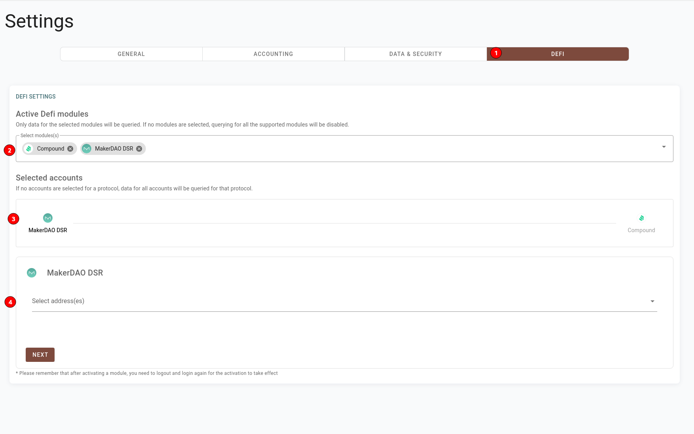

Activating/Deactivating Modules
----------------------------------

You can activate a module by selecting it from the dropdown menu that appears when you search in the "Select modules" input field.
An active module will be visible in the input. In the screenshot above for example the Compound and MakerDAO DSR modules are active.

To disable a module you need to press the (x) button at the end of the entry.

After enabling or disabling a module you need to re-login again for the changes to take effect.

Selecting Addresses
----------------------

In order to limit the querying only to selected addresses instead of all the eligible ones you can go to the "Select Accounts"
and click on the module you are interested in (3). The module address selection (4) for this module should be visible.

Search for each address you are interested and then select each one from the dropdown menu. The selected addresses should
be visible in the same way as the modules above. To remove an address you need to press the (x) button at the end of the entry.

If no addresses are selected for a module this means that rotki will check all the eligible addresses which can add to the total query duration.

Importing data
*******************

In this section we will explain how you can import data by integrating with external services such as crypto exchanges

Adding an exchange
=====================

.. image:: images/add_exchange.gif
   :alt: Add API keys for a new exchange
   :align: center

You can integrate many different exchanges with Rotki. Currently supported exchanges are: Kraken, Poloniex, Bittrex, Bitmex, Binance, Coinbase, Coinbase Pro and Gemini.

To do so you have to go to your exchange and create an API key (see the section :ref:`api-key-permissions`).

Click on the "API keys" on the left sidebar. This will take you to the place where you can add new exchange API keys. Select the exchanges panel and select your exchange from the dropdown menu. Then copy and paste the ``API Key`` and the ``API Secret`` in the respective text fields and press submit.

If all went well, then you will get a confirmation that the connection was successful. If not please doublecheck that the key and secret are correct.

.. _api-key-permissions:

API key permissions
--------------------

Rotki only needs read-only permissions for your accounts. As a general rule, exchanges (e.g. Binance, Coinbase Pro) group all the read-only permissions as "read" or "view".

.. image:: images/add_exchange_api_keys_binance.png
   :alt: Simple API key permissions
   :align: center

In case of an exchange providing a more granular permissions scheme (e.g. Coinbase, Kraken) or having additional options (e.g query limits, passphrase), refer to the exchange documentation or get in touch via their customer support channel.

.. image:: images/add_exchange_api_keys_coinbase.png
   :alt: Granular API key permissions
   :align: center

You may as well try creating an API key with the minimum read-related permissions, then adding it in Rotki and finally checking that the connection was successful and data was loaded as expected. Otherwise, try again adding more read-related premissions.

Adding an external service API Key
=====================================

Rotki relies on various external services for data such as historical crypto prices or ethereum transactions. To get that data some of these services require API keys. So you should go to their webpage, create a free account and generate an API key. Once this is done you can enter the API key in the section of the API keys page.

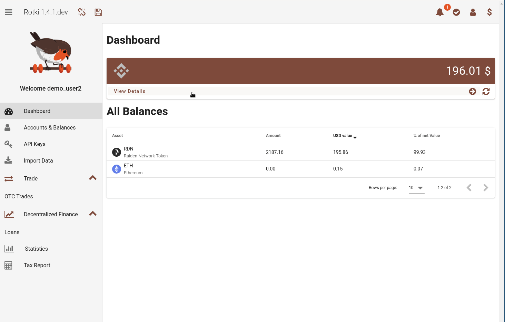

At the moment there is no compulsory API key. But if you don't use your own node etherscan queries without an API key are really slow. So if you don't already have an account with them please create one `here <https://etherscan.io/register>`_ and then generate a free API key and set it in the app as explained above. It's free of charge.

Cointracking.info
====================

You can also import data from `cointracking.info <https://cointracking.info/>`_ into Rotki by clicking on "Import Data" on the left sidebard and then following the instructions.

Rotki can import any trade CSV data exported from cointracking.info. But in general it's not recommended to utilize cointracking as their exported data are missing a lot of information.

.. image:: images/sc_data_import.png
   :alt: Importing data from cointracking.info
   :align: center

Tracking accounts and balances
**********************************

To manage Accounts & Balances (Blockchain Balances, Exchange Balances, and Manual Balances including fiat) you need to visit the "Accounts & Balances" section from the left sidebar.

.. image:: images/sc_accounts_balances.png
   :alt: Accounts & Balances page
   :align: center

Adding Manual Balances
==================================

With Rotki you can also add balances/accounts for any type of asset and location that may not be supported at the moment. For example real estate, equity holdings or holdings in a not yet supported blockchain or exchange.

To add or modify a manually tracked balance navigate to the "Manual Balances" sub-page and click the large "+" icon. There choose the asset from the dropdown menu, input a unique label for the account, decorate it with any number of tags and choose an amount and location.

.. image:: images/sc_manually_tracked_balances.png
   :alt: The manually tracked balances
   :align: center

Adding and Removing Blockchain Accounts
============================================

Rotki allows to track balances of blockchain accounts.

To add or modify an account navigate to the "Blockchain Balances" sub-page and click the large "+" icon. Now choose the blockchain on which you want to add an account (for now only Bitcoin and Ethereum chains are supported). Then type or paste the address in the "Account" textbox and press the "Save" Button.

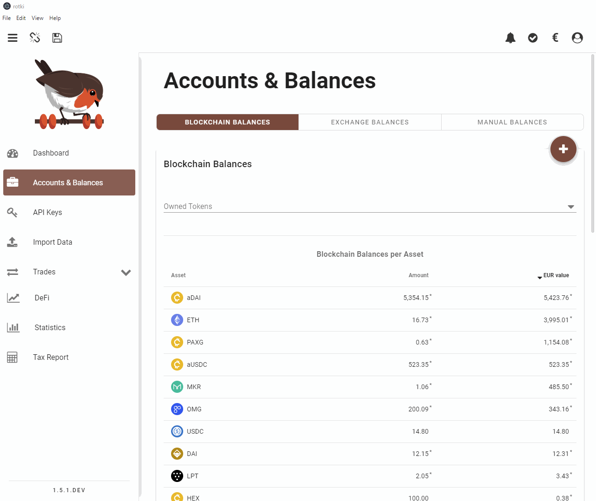

To stop tracking a particular account scroll down to the accounts tables and click the "Delete" icon (trashcan) under Actions.

If an ethereum account also contains tracked tokens you can click on the arrow under "Actions" in order to expand its view and show the balance breakdown for the account over all assets it holds.

Checking Exchange Balances
===========================

You can check all of the asset balances that you have in each connected exchange in the "Exchange Balances" sub-page. Clicking the large "+" icon takes you to the API Keys page where you can manage your exchange connections ( see `Adding an exchange`_).

.. image:: images/sc_exchange_balances.png
   :alt: Exchange Balance
   :align: center

Adding/Editing Labels and tags
==============================

You can edit any of your blockchain accounts and add a label. The label is unique to the account and will show up in the accounts tables instead of the address. You will still be able to see the address if you hover over the label in the tables.

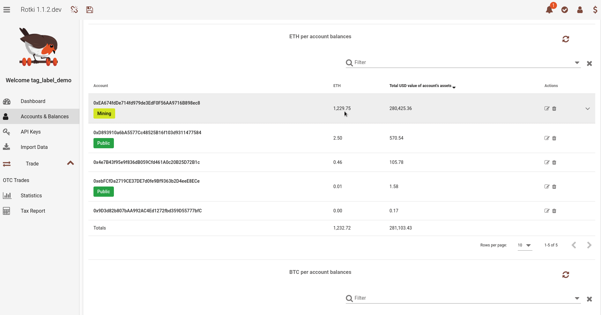

By pressing the edit button for the account you can also add tags to the blockchain account. If you want to create a new tag or edit an existing one you can open the tag manager and choose the name, description and colors of the tag.

Filtering by tags
=====================

You can filter the tables by a combination of tags.

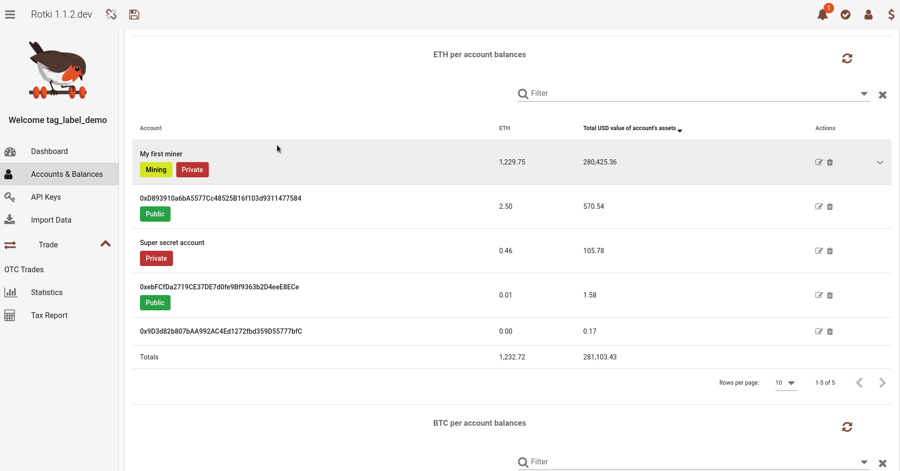

Simply add the tags you wish to filter by in the filter textbox above the tables.

Manually adding trades or other events
*******************************************

Rotki will pull all your trade history from the exchanges whenever it needs it. But most of us have probably also done some OTC trades or taxable events at some point. Such events could even just be mining tokens, depending on your jurisdiction, participating in an ICO or getting paid in crypto.

On the left sidebar click on the trades button and select "OTC Trades" from the dropdown menu. This will take you to the OTC Trades page.

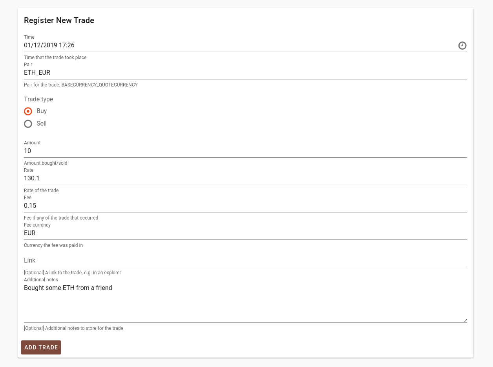

To add a new trade or taxable event, fill in all the fields and press the "Add Trade" button.

Some very important things to note. All pairs should be in the form of ``BASECURRENCY_QUOTECURRENCY``. For a ``buy`` this means you are buying ``amount`` of the ``BASE`` currency at a price of ``rate`` ``QUOTE`` currency per ``BASE``. For a ``sell`` this means you are selling ``amount`` of the ``BASE`` currency at a price of ``rate`` ``QUOTE`` currency per ``BASE``.

If there was a fee for the trade you should input it in the corresponding box and also enter the currency the fee was paid in. Fee can also be 0.

You can optionally provide additional notes or even links to blockchain explorers for each trade.

At the bottom of this page you can see a table of all your OTC trades. You can edit or delete a trade by clicking on the appropriate icon at the rightmost part of each trade under the "Actions" column.

Decentralized Finance
**********************

To track and analyze your DeFi actions use the Decentralized Finance tab from the left side menu. You can choose from the different types of DeFi actions presented in the submenu.

Lending
===========

In the lending section you can see the status of your DAI in the DAI Savings Rate (DSR). The accounts that use DSR are auto-detected from your given blockchain accounts. You can see how much DAI you have locked over all of your accounts and how much DAI is locked for each account in the DSR.

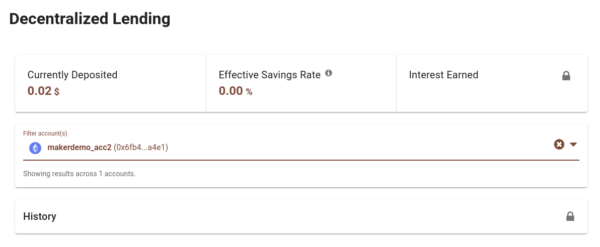

You can also filter by account and see how much DAI is locked in the DSR for each account.

If you have a premium subscription you can also see how much DAI you have gained in total or over each account, the history of deposits/withdrawals and how much DAI was earned at the point in time for each action.

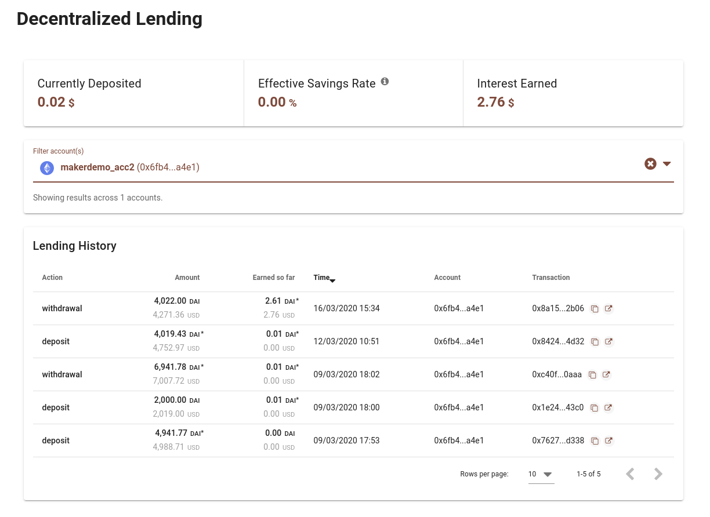

Finally you need to have premium in order for the total amount of DAI earned in a given time period to be counted in the profit/loss report.

Below you can see a small demonstration of the usage of DSR by a premium account.

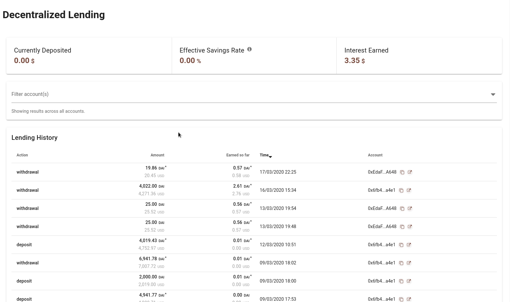

Borrowing
=============

In the borrowing section you can find information on your makerdao vaults. The vaults are autodetected from your ethereum accounts and information about each one of them is displayed.

As a normal non-premium user you can see all your vaults, and for each one inspect the locked collateral, collateralization, debt generated and the liquidation price.

.. image:: images/sc_vaults_nonpremium.png
   :alt: Makerdao vaults without a premium account
   :align: center

With a premium subscription you can also see additional information such as the creation time of the vault, list of historical activities, total interest owed and liquidation events.

.. image:: images/sc_vaults_premium.png
   :alt: Makerdao vaults with a premium account
   :align: center

Premium users can also have makervault interest taken into account in the profit/loss report.

Finally premium users can create watchers for their vaults.

.. image:: images/sc_vaults_premium_watchers.png
   :alt: Makerdao vaults with a premium account
   :align: center

They can add a target collateralization ratio they would like rotki to watch for in a vault. If the collateralization ratio becomes less/greater than that ratio then an alert is sent to your email. This watcher service runs on the rotki server so you don't even need to leave the application open.

Below you can see a small demonstration of the usage of makerdao vaults by a premium account.

.. image:: images/vaults_premium_demo.gif
   :alt: Makerdao vaults premium demo
   :align: center

Creating a profit/loss report
*****************************

Rotki creates a profit/loss report for you based on your trades and other events and the provided accounting settings. This is essentially a calculation of profit or loss for all your events based on the given dates. Before getting into the details of generating a report, here's a few important details regarding the report generation algorithm:

- By default, rotki uses an accounting strategy called "First In - First Out" (short: FIFO). There are plans to implement other strategies (e.g. `"Last In - First Out" <https://github.com/rotki/rotki/issues/44>`_).
- Rotki allows users in jurisdictions offering a tax free holding period (e.g. Germany with 1 year) to specify the period in days. To adjust this value, see the section `Customizing the account settings <#tax-free-period>`_.
- When generating a report for a custom period, where rotki is aware of the user's previous crypto holdings (e.g. we trade BTC between the years 2017 - 2019 but we ask for a report between 2018 - 2019), it takes all prior crypto holdings into account to calculate a starting balance for the given period. For example, say you traded BTC between 2017 - 2019 with a balance of 0.1 BTC on December 31, 2017. When generating a pnl report for 2018 - 2019, rotki will take the 0.1 BTC from December 31, 2017 as a start balance for its calculations in the period of 2018.

To create a profit loss report click on the "Profit and Loss Report" button from the left menu. Choose a period for the report (or click on Custom to set a custom time range) and press on "Generate" to start the report.

.. image:: images/sc_pnl_report1.png
   :alt: Overview of the profit/loss report
   :align: center

The calculation may take some time. You can also see a summary of the accounting setting the report is running with in the "Accounting settings" section.

If you encounter any problems during the profit/loss report check out the :ref:`troubleshooting-pnl-report` section.

Once done you have an overview of the profit/loss for the given period, how much of that is taxable, and how much each taxable event category contributes to the total.

Additionally below the overview you get a table containing all of the events that were taken into account in the calculation along with how much of the ``profit_currency`` you lost or gained through that event.

.. image:: images/sc_pnl_report2.png
   :alt: Event list of the profit/loss report
   :align: center

Finally you can get a CSV export by pressing the "Export CSV" button. This export is meant to be imported into Google Sheets. Press the button and then choose a directory to write the CSV files to. Once done you can import the CSV files into Google Sheets via its import menu. Following are definitions for the all_event document's columns

- ``type`` is a string describing the type of event a user engaged in, e.g. in "I buy ETH for EUR", buy is the ``type``.
- ``location`` is a string describing the location the event occured at. For example "kraken" for kraken trades.
- ``paid_asset`` is a string identifying the asset an event was paid in, e.g. in "I bought 1 ETH for 100 EUR", EUR is the  ``paid_asset``.
- ``paid_in_asset`` is a number specifying the amount of ``paid_asset`` involved in an event, e.g. in "I bought 1 ETH for 100 EUR", 100 is the ``paid_in_asset``.
- ``taxable_amount``: is a number specifying the amount of ``paid_asset`` needed to be taken into consideration for tax purposes according to the accounting settings, e.g. "I sold 1 ETH for 120 EUR", 1 ETH is the ``taxable_amount``.
- ``received_asset`` is a string identifying the asset of an event's yield, e.g. in "I bought 1 ETH for 100 EUR", ETH is the ``received_asset``.
- ``received_in_asset`` is a number specifying the amount of ``received_asset`` involved in an event, e.g. in "I bought 1 ETH for 100 EUR", 1 is the ``received_in_asset``.
- ``net_profit_or_loss`` is a number specifying the amount of profit or loss an event accounts for given the selected accounting strategy. Note that its value is based on a spreadsheet formula.
- ``time`` is a string containing the date and time an event was executed.
- ``is_virtual`` is a boolean describing if an event is a virtually generated event. Only appears if the crypto to crypto setting is set. In many jurisdictions, crypto to crypto trades are taxable at the rate of the equivalent fiat currency. So an additional virtual buy is always generated for a crypto to crypto sell and the opposite for a crypto to crypto buy. So for example selling BSV for BTC would also make the user buy BTC with EUR as a virtual event, assuming EUR is the set profit currency.
- ``paid_in_XXX``, where XXX is the user's customized ``profit_currency`` is a number describing the amount of ``paid_in_asset`` converted to the user`s ``profit_currency``.
- ``taxable_received_in_XXX`` where XXX is the user's customized ``profit_currency`` is a number describing the amount of ``received_in_asset`` converted to the user's ``profit_currency``. Note that rotki additionally subtracts an exchange's trading fees from this number.
- ``taxable_bought_cost_in_EUR`` where XXX is the user's customized ``profit_currency`` is a float simulating the total amount of ``paid_in_asset`` given the user's customized accounting strategy in the user's ``profit_currency``.
- ``cost_basis`` If this is a spending event, this field contains information about where the amount that is spent came from according to the user's setting. Which buys contributed to this spend. If not enough information is known then this is also stated.

.. note::
   To learn more about `profit_currency` or to adjust it, see the section :ref:`change_profit_currency`

Analytics
**********

If you have a premium subscription you can get analytics on your all your assets and trades.

Click on the analytics page on the left sidebar to go to your analytics page.

Since Rotki is tracking all your assets over time the first thing you can see is a value/time graph of your entire net value.

.. image:: images/sc_stats_netvalue.png
   :alt: Netvalue over time graph
   :align: center

Following that you can see a graph of quantity of an asset superimposed on its USD value over time.

.. image:: images/sc_stats_asset_amount_value.png
   :alt: Asset amount and value over time
   :align: center

Furthermore you can see a piechart of the distribution of your netvalue across different locations. So you can determine how exposed you are to having a big part of your net value in exchanges, in banks e.t.c.

.. image:: images/sc_stats_distribution_location.png
   :alt: Distribution of networth by location
   :align: center

Finally you can see a piechart of the distribution of your netvalue across all of the assets you own. This is an important analytics tool as it can help you determine your exposure on each asset and if some rebalancing of your portfolio is in order.

.. image:: images/sc_stats_distribution_asset.png
   :alt: Distribution of networth by asset
   :align: center

.. _set-the-backend-s-arguments:

Set the backend's arguments
*******************************

Rotki runs a python daemon on the backend. Most times you won't need to customize its arguments but if you need to do so, especially for debugging purposes this is how you can.

Create or edit if it exists a file with the name ``rotki_config.json`` in the same directory as the rotki executable. Add to the json object any arguments that are also arguments of rotki. Then when rotki starts these will be passed as arguments to the backend. An example ``rotki_config.json`` follows::

  {
      "loglevel": "debug",
      "logfromothermodules": false,
      "logile": "filenameforthelogs",
      "data-dir": "/path/to/dir"
      "sleep-secs": 20
  }

The above arguments are:

- **loglevel**: Set the loglevel for the application. Valid values are: ``'debug', 'info', 'warn', 'error', 'critical'``.
- **logfromothermodules**: If this argument appears then logging will also include log entries from other dependent libraries and not only rotki. Default is ``false``.
- **logfile**: The name for the logfile. Default is: ``rotkehlchen.log``.
- **data-dir**: The path to the directory where all rotki data will be saved. Default depends on the user's OS. Check next section
- **sleep-secs**: This is the amount of seconds that the main loop of rotki sleeps for. Default is 20.

.. _rotki_data_directory:

Rotki data directory
***********************

Rotki saves user data by default in a different directory per OS. For each OS data is stored in the respective standards compliants equivalent directory.

- **Linux**: ``~/.local/share/rotki/data/``
- **OSX**: ``~/Library/Application Support/rotki/data``
- **Windows**: ``%LOCALAPPDATA%/rotki/data``

Before v1.6.0 Rotki was saving data in ``$USER/.rotkehlchen``. From v1.6.0 that directory got migrated to the OS equivalent standard directory and it should be safe for the users to delete the old directory as long as the new directory contains the migrated DB.

A very good idea about the rotki data directory would be to be making frequent backups of it as it contains all of the data of all of your rotki accounts and cache data for historical price queries.

Troubleshooting
*****************

Out of gas error during eth_call
========================================

If you see an error like the following::

  [17/12/2020 18:31:29 CET] WARNING rotkehlchen.chain.ethereum.manager: Failed to query own node for <bound method EthereumManager._call_contract of <rotkehlchen.chain.ethereum.manager.EthereumManager object at 0x7f4b16b8bc90>> due to Error doing call on contract 0x06FE76B2f432fdfEcAEf1a7d4f6C3d41B5861672: {'code': -32000, 'message': 'out of gas'}

while rotki is querying your local geth node for something then it means that the query has hit the gas limit cap.

You can fix this by simply adding the ``--rpc.gascap 0`` argument to your geth node. This will have an unlimited gascap. Be careful if it's a node exposed to the public as this may allow a malicious ``eth_call`` to crash your node.

Local system clock is not synchronized
========================================

Some remote servers (e.g. exchanges) require your local system clock synchronized with theirs. In case of not having it synchronized the request will fail and Rotki will either display a specific error message (i.e. 409 status code and a *local system clock is not sync* message) or the generic 500 error one (please, :ref:`report it to us <bug_reporting>`).

Follow your OS official guidelines about how to synchronize the clock with an Internet Time Server and try again.

Restoring backed up database at new account creation fails
============================================================

Please, make sure you are using your premium subscription API keys/secret and the same password.

Data with multiple accounts/devices is not synced
===================================================

Please, make sure all your accounts have the "Allow data sync with Rotki Server" switched on, and that on each log-in you make the appropriate choice when prompted to replace the local database. See the section :ref:`sync-data-with-rotki-server` for more information about how to sync data with multiple accounts/devices.

.. _troubleshooting-pnl-report:

Profit/loss report creation problems
===========================================

Timeout or price not found for timestamp
-------------------------------------------------

Figure out which asset caused the price not found. Then check the historical price caches and make sure you have the historical price cache for that asset pair created. For example if you are creating a GBP profit/loss report and the asset is GNO then make sure to create the GNO -> GBP historical price cache. See :ref:`manage-historical-price-cache` on how to do it.

