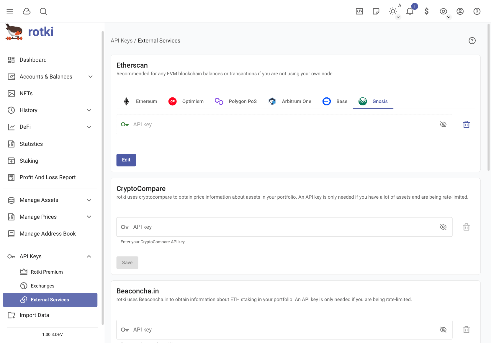

rotki Usage Guide
#####################
.. toctree::
  :maxdepth: 2


Introduction
*************

In this section we are going to see how to use various parts of the rotki application.


First time sign-up
====================

When you start rotki you are greeted with a sign-in/signup prompt.

.. image:: images/rotki_login_screen.png
   :alt: Creating a new account
   :align: center

.. role:: red

For creating an account press "Create New Account".
You can choose to enable premium feature or not.

If you want to restore an account using premium sync during the account creation, then you can **Enable premium**,
and enable **Restore synced database**, and insert your **API Key** and the **secret** here.

Then you can click **Continue** button.

.. image:: images/rotki_create_account_enable_sync.png
   :alt: Enable premium sync
   :align: center

You have to provide a username and a password:

  - **Username**: it is just an identifier for your database; a local user.
  - **Password**: :red:`Do not forget this password`. It is used to encrypt all your local files.

For a completely new account, premium API key and secret can be added either using the prompt provided or using :ref:`set-up-rotki-premium`
after logging in with the new account.

.. image:: images/rotki_create_account.png
   :alt: Creating a new account
   :align: center

All accounts are created in the rotki directory, see the section :ref:`rotki_data_directory` to know where it is located.


Create a new account that restores a backed up database (premium user only)
=============================================================================

If you have a premium subscription and you want to create a new local account that restores the backed up database, for example in a different device, you must add the **API key/secret** and :red:`use the same password`. If the password is not the same, opening the database will fail.

.. image:: images/rotki_premium_signup_failed.png
   :alt: Sign-up with existing premium subscription using a wrong password
   :align: center

See the section :ref:`sync-data-with-rotki-server` to know more about how the premium subscription will behave with multiple accounts/devices and how to sync your data with Roki Server (this option is disabled by default).


Sign-in
=========

If you already have an account just write the name and the password at the sign in prompt.

.. _set-up-rotki-premium:

Set up rotki Premium
======================

If you decide to purchase `rotki Premium <https://rotki.com/products/>`_ at a later time, you can set it up via :menuselection:`API Keys --> rotki Premium`.

.. image:: images/rotki_premium_set.png
   :alt: Set up rotki premium API key/secret pair in an existing account
   :align: center

If after you have set up premium you wish to replace or disassociate keys with the currently logged-in account, you can do so via the same page.

.. image:: images/rotki_premium_del.png
   :alt: Delete up rotki premium API key/secret pair in a premium account
   :align: center

.. _sync-data-with-rotki-server:

Sync data with rotki Server
-----------------------------

To back up your data in the rotki Server switch on "Allow data sync with rotki Server". This allows you to restore it later on in any account/device as long as :red:`the same API Key/secret and account password are used`.

.. image:: images/rotki_premium_set_sync_data.png
   :alt: Sync data with rotki Server
   :align: center

Bear in mind that in case of using multiple accounts/devices with the data sync enabled, the one with the most recent login will upload the most up-to-date data to rotki Server. After that, using the same account from another device may ask you whether you want to replace your local database with the remote one.

.. image:: images/rotki_premium_replace_local_db_with_remote.png
   :alt: Replace local database with remote backup
   :align: center

You can manually move the global DB that contains the assets from one system to the other too. Find the :ref:`rotki_data_directory` in the source system. Assuming it's linux it will be :file:`~/.local/share/rotki/data`. The global db is then :file:`~/.local/share/rotki/data/global_data/global.db`. Manually move it to the equivalent location in the new system.


Upgrading rotki after a very long time
========================================

If you have not opened rotki for more than a year and a half and you have data you want to keep in your account then you will need to upgrade it with intermediate versions before being able to use the latest one. If this is the case you will see a notification when you try to start rotki. For now this will happen if the last version that you used with your database was ``1.17.x``.

The steps to update your database if you get this error are the following:

1. Download version `1.25.2 of rotki <https://github.com/rotki/rotki/releases/tag/v1.25.2>`__ from the release page and install it.
2. Log into your account with rotki 1.25.2. The upgrade process should happens and your account's database should be updated. If the upgrade was successful in the settings :ref:`database-info` you will see that the ``Database version`` is now ``34``. You can now close rotki.
3. Download the `latest version of rotki <https://github.com/rotki/rotki/releases/>`__ and install it.
4. Open your database with the latest version.

After completing these steps you should be good to go.

The supported database versions per rotki version are:

- ``rotki <= 1.25.2``: Version 1 to 34 of the database.
- ``rotki >= 1.26.x``: Version >= 26 of the database.

Customizing
**************

This section contains information about how to customize the application through the settings. By clicking on the user icon on the top right and choosing settings you can customize some basic settings for the application.


.. _change_profit_currency:

Changing the Profit Currency
=============================

rotki calculates everything, including your total profit/loss during the PnL report into a given fiat currency. This is what we call the ``profit_currency``. By default this is USD. You can easily change this setting by clicking on the currency icon the top right menu and changing it to the currency you are using.

.. image:: images/sc_profit_currency.png
   :alt: Changing the profit currency
   :align: center

Customizing the application settings
====================================

By choosing the "General" settings button you can customize some general application settings.


.. image:: images/sc_general_settings.png
   :alt: Customizing the general app settings
   :align: center

General Settings
----------------------

Anonymous usage analytics
^^^^^^^^^^^^^^^^^^^^^^^^^^^^^

Specify whether the application is allowed to submit anonymous usage analytics. As a local application rotki has no other way to measure how many active users it has other than submitting some form of analytics. The data that are submitted are completely anonymized and contain no sensitive information.

Balance data saving frequency
^^^^^^^^^^^^^^^^^^^^^^^^^^^^^^^^^

Set how often (in hours) the data of all balances will be saved. This data is used to calculate statistics and other historical data to show to the user.

Date display format
^^^^^^^^^^^^^^^^^^^^

Set the display format of the dates in the rotki user interface. One such format is ``%m/%d/%Y %H:%M:%S``. That means month/day/year hour:minutes:seconds. For possible valid formats check `here <https://docs.python.org/3/library/datetime.html#strftime-and-strptime-format-codes/>`__.

Display in local time
^^^^^^^^^^^^^^^^^^^^^^^

Choose whether local time or UTC should be shown in the CSV exports, user logs in the backend and other locations.

BTC Derivation gap limit
^^^^^^^^^^^^^^^^^^^^^^^^^^

This is the derivation gap limit that will be used when trying to derive addresses from a bitcoin xpub. For more information check `here <https://blog.blockonomics.co/bitcoin-what-is-this-gap-limit-4f098e52d7e1>`__.

Treat staked ETH as ETH
^^^^^^^^^^^^^^^^^^^^^^^^^^^

If this setting is set then ETH2 (staked ETH) will appear as ETH in the UI and all the tables and charts will use ETH combining the values of both ETH and ETH2.


Amount Settings
-----------------

.. image:: images/sc_amount_settings.png
   :alt: Customizing the app's amount settings
   :align: center

Floating precision
^^^^^^^^^^^^^^^^^^^^

Set how many decimal points should be shown in the UI for floating point numbers.

Main currency
^^^^^^^^^^^^^^^^

Same as `changing the profit currency <change_profit_currency_>`_.

Thousands separator
^^^^^^^^^^^^^^^^^^^^^^

This is the symbol that will be separating the numbers every 3 digits for big numbers. For example in 1,000,000, the symbol is ``,``.

Decimal separator
^^^^^^^^^^^^^^^^^^^^^^

This is the symbol that will be separating the floating part of the number. For example in 5.42 the symbol is ``.``.

Currency location
^^^^^^^^^^^^^^^^^^^^

This setting chooses if the currency symbol will be shown before ($1,000) or after(1,000$) the number.

Amount Rounding
^^^^^^^^^^^^^^^^^^

This setting modifies the rounding mechanism choosing from ``Round up``, ``Round down`` and ``Half even`` (rounds to the nearest value). It can be individually modified how amounts and values are rounded.

Ethereum RPC nodes
^^^^^^^^^^^^^^^^^^^^^

This setting allows you to modify the nodes that will be queried to interact with the Ethereum blockchain. We provide a list of public nodes but sometimes they are not available or are overloaded. This is why it is a good idea to have more nodes just in case and to have the possibility to customize the priority with which they are queried.
When making queries we always give preference to your own nodes if you have any and then add a small list of randomly selected open nodes in case they are needed. If you don't have your own node then the open nodes are always selected. The weight of the node sets the probability
of picking it and is represented by a percentage. From that list is also possible to mark them as active or inactive by using the toggle button.

.. image:: images/rotki_nodes_management.png
   :alt: Customizing the app's connection to ethereum nodes
   :align: center

In this menu you can also edit, delete or add more nodes.


The slider lets you modify the weight of the node and you can also manually imput a value. The owned parameter gives priority to the selected node over the rest of not owned nodes. You can also mark the node as not active in this screen to completely ignore it in the selection process.
Similarly you can add more nodes.


Local nodes
------------

Connecting to a Kusama Client
^^^^^^^^^^^^^^^^^^^^^^^^^^^^^

When rotki begins it tries to connect to a local kusama node running with an rpc port set at the default port ``9933``. If no client is running then all blockchain queries will use an external service that can be slower or not available at the moment.

Connecting to a Polkadot Client
^^^^^^^^^^^^^^^^^^^^^^^^^^^^^^^

Just like with kusama you can set the rpc endpoint of a Polkadot node you would like to connect to here.


Price Oracle settings
---------------------

.. image:: images/sc_priceoracle_settings.png
   :alt: Customizing the app's price oracle settings
   :align: center

Here you can customize the precedence of querying that price oracles will have. That means which price source to check first, which second and so on and so forth both for current but also for historical prices.

DeFi oracles like Uniswap V2 and Uniswap V3 use only on chain information to get current prices, this means that it is a bit slower to query information from them but you depend only on the ethereum chain to query the prices.
Also prices for some assets may differ from Coingecko or CryptoCompare depending on the conditions of the pools at the moment of making the query.

Frontend only settings
-----------------------

.. image:: images/sc_frontendonly_settings1.png
   :alt: Customizing the app's frontend only settings
   :align: center

Animations effect
^^^^^^^^^^^^^^^^^

It is possible to reduce the animation effect in differents part of the app to improve the performance in case where this is needed. This will affect the quality of the animations but the user will get a better usage of the resources.

Data scrambling
^^^^^^^^^^^^^^^

When turned on this setting allows you to randomize a lot of amount numbers, dates and other data in the app so that you can share screenshots without leaking real data. This setting does not persist across sessions!

Dashboard graph default timeframe
^^^^^^^^^^^^^^^^^^^^^^^^^^^^^^^^^^

Set the default time frame for the dashboard graph. This timeframe will be pre-selected upon login. By default it will remember the previous session's selection.

Graph basis
^^^^^^^^^^^^^^^^^^^^^

Configure whether the graph y-axis will start at 0 or the minimum amount for the period.

Include NFTs in graphs and total amounts
^^^^^^^^^^^^^^^^^^^^^^^^^^^^^^^^^^^^^^^^

Configure whether to include NFTs in the calculation for the total net worth and the graphs displayed in the dashboard and statistic section.


Automatic balance refresh
^^^^^^^^^^^^^^^^^^^^^^^^^^^^^^^^^

This enables/disables automatic refresh of balances. Also sets the distance in time between each refresh. Automatic balance refresh is disabled by default because balance querying can get really slow and also get you rate limited.

Periodic status query
^^^^^^^^^^^^^^^^^^^^^^^^^^^^

The rotki frontend continuously queries the backend for various data and updates. This is an inexpensive operation that is set by default to 5 seconds. You can customize the frequency of that query here.

.. image:: images/sc_frontendonly_settings2.png
   :alt: Customizing the app's frontend only settings
   :align: center

Blockchain explorer customization
^^^^^^^^^^^^^^^^^^^^^^^^^^^^^^^^^^^^^^^^^^

You can customize in which explorer the transaction and addresses links open.

Theme [Premium]
^^^^^^^^^^^^^^^^^^^^

Premium users can customize the color them for either light or dark mode.


Customizing the accounting settings
====================================

By choosing the "Accounting" settings button you can customize some application settings that pertain to accounting calculations.

You should understand what each setting does, consult with a tax accountant for your jurisdiction and then set them appropriately.

The default settings are at the moment set for the German tax jurisdiction. For example all profit/loss calculation is done for trades on a first-in/first-out basis and profits from selling crypto assets after 1 year are non taxable. These settings can be adjusted.

Trade settings
----------------

.. image:: images/sc_accounting_settings.png
   :alt: Customizing the accounting trade settings
   :align: center

Crypto to crypto trades
^^^^^^^^^^^^^^^^^^^^^^^^^^^

Specify whether crypto to crypto trades are taxable and should be taken into account. If yes then each crypto to crypto trade also creates a "virtual" trade that sells or buys the crypto asset for fiat and then sells or buys the fiat for the other crypto asset.

Ethereum gas costs
^^^^^^^^^^^^^^^^^^^^^^

Specify whether ethereum transaction gas costs should be counted as loss. If this is set then all ETH spent on gas will be deducted from your profits and count as an expense.

Tax free period
^^^^^^^^^^^^^^^^^^^^

Specify whether there is a period of time and if yes how many days, after which holding a crypto asset is considered not taxable.

Asset movements fees
^^^^^^^^^^^^^^^^^^^^^^^

Specify whether deposit/withdrawal fees should count as expenses during the profit/loss report.

Calculate past cost basis
^^^^^^^^^^^^^^^^^^^^^^^^^^^^^

When creating a profit/loss report we also need to figure out where and when all of the assets that the user is using were acquired from. Which is why we also go through all past events, even before the start of the period.

This behavior can be disabled by turning this setting off.

Omit ETH staking events
^^^^^^^^^^^^^^^^^^^^^^^^^^^

Specify whether the staking of ETH is taxable only after the merge and withdrawals are enabled or if each eth staking event is considered taxable at the point of receiving if you can't yet withdraw.

Cost basis method
^^^^^^^^^^^^^^^^^^^^^

The method that should be used during the profit and loss execution to calculate cost basis. The methods available at the moment are:

- FIFO: `First In First Out`
- LIFO: `Last In First Out``

Asset settings
--------------

.. image:: images/sc_accountingasset_settings.png
   :alt: Customizing the accounting asset settings
   :align: center


Ignored assets
^^^^^^^^^^^^^^^

Specify which assets you own and would like to completely ignore from all calculations and balance queries. Any actions that involve these assets are ignored.
We have introduced a mechanism to populate the ignore list with assets labeled as spam/scam by us. This list can be re-queried at any time by the user by clicking on ``Sync the list of ignored assets``.

You can also ignore asset by clicking asset icons anywhere on the app, that will redirect you to this overview asset page. In this page, you can ignore or un-ignore selected asset.

.. image:: images/asset_overview.png
   :alt: Asset overview page
   :align: center


.. _ledger_action_settings:

Ledger action settings
-----------------------

.. image:: images/sc_accountingledgeraction_settings.png
   :alt: Customizing the accounting ledger action settings
   :align: center

Here you can choose which types of historical actions should be considered taxable and which not. For example in Germany airdrops are considered windfall profits and are not taxed, so you can specify that here.


CSV Export settings
--------------------


Export formulas
^^^^^^^^^^^^^^^

Specify whether formulas should be exported as formulas in the CSV export or if the actual value should be simply exported.


Have summary
^^^^^^^^^^^^^^^

Specify whether at the end of the all_events CSV export there should be a summary of all events and the total profit/loss or not. Additionally at this summary there would be the rotki version and the settings used during the PnL report so it's easy to reproduce a report run.

Customizing data & security settings
====================================


Changing password
---------------------

By choosing the "user & security" section of the settings you can change the user password.

.. image:: images/sc_user_password_change.png
   :alt: Changing the user's password
   :align: center

.. _database-info:

Database Info & User Database Backups
-------------------------------------

By visiting the database info section you can see information about your user and global database,
such as the user database directory, size and version.

.. image:: images/sc_db_backup.png
   :alt: Creating database backups
   :align: center

You can create new database backups by pressing the ``Create new backup`` button.
To delete a backup you can press the trash can icon on the database row.

The download button provides an easy way to save the backups locally, and it can be
especially helpful if you run the docker instance on a remote machine.

Exporting and importing custom assets
-------------------------------------

When migrating from one computer to another you will also need to move your custom assets entries.
To do this you can use the export/import function provided by rotki.

This function will create a zip archive of all your custom assets. You can then use the import function
in a different instance of rotki to easily transfer your custom asset entries.

.. image:: images/sc_custom_import_export.png
   :alt: Importing
   :align: center

.. warning::
    This archive cannot be used as a backup/restore across different versions of rotki since there is
    absolutely no guarantee that there will be no breaking format changes across versions.

Purging data
-----------------

rotki keeps a lot of data cached locally in the user's DB. There may be the need to clean some of these data from time to time. You can do so from the "Manage Data" section of the settings, by clicking on the dropdown list, selecting the type of data you want to delete and then pressing the Trash button.

.. image:: images/sc_purge_data.png
   :alt: Purging user data
   :align: center


.. _manage-historical-price-cache:

Manage historical price oracle cache
--------------------------------------------

Querying historical prices from oracles such as cryptocompare and coingecko is slow and can get slower as a result of rate limiting. That is why rotki creates historical price caches during idle time of the application.

You can request the creation of such a cache by going to the Oracle cache section, selecting the oracle, the from asset of the pair, the to asset of the pair and then pressing the Cache pair prices.


.. image:: images/sc_historical_price_cache1.png
   :alt: Creating a historical price cache
   :align: center

Users can also manage the existing historical price cache entries. They can inspect when does the historical price data start, when does it end and if they want they can delete the cache by pressing the trash button.

.. image:: images/sc_historical_price_cache2.png
   :alt: Managing the historical price cache
   :align: center

.. _customize-module-settings:

Customizing the Module settings
====================================

By choosing the "Module" section of the settings you can customize the enabled modules and the queried addresses for each module for the application.

The benefit of enabling only the modules you use, and specifying the addresses, is that rotki will only
query the specified addresses for the enabled modules. This can considerably improve the querying speed.

.. image:: images/module_settings.png
   :alt: Managing module settings
   :align: center


Activating/Deactivating Modules
----------------------------------

You can activate a module by selecting it from the dropdown menu that appears when you search in the "Select modules" input field.
An active module will be visible in the input. In the screenshot above for example the Compound and MakerDAO DSR modules are active.

To disable a module you need to press the (x) button at the end of the entry.

After enabling or disabling a module you need to re-login again for the changes to take effect.

Selecting Addresses
----------------------

In order to limit the querying only to selected addresses instead of all the eligible ones you can go to the "Select Accounts"
and click on the module you are interested in (3). The module address selection (4) for this module should be visible.

Search for each address you are interested and then select each one from the dropdown menu. The selected addresses should
be visible in the same way as the modules above. To remove an address you need to press the (x) button at the end of the entry.

If no addresses are selected for a module this means that rotki will check all the eligible addresses which can add to the total query duration and considerably slow down retrieving data from the app.

Changing the backend settings
====================================

Users of the desktop app can change the default data directory, and log directory. This can be done via the login
screen. You can click the cog wheel at the bottom right corner to view the backend settings dialog.

.. image:: images/rotki_backend_settings.png
   :alt: Change the backend settings
   :align: center

After selecting a new data directory, log directory etc you can press the save button to save your settings.

Keep in mind that any accounts that were created in the previous directory will not be accessible anymore and you will
have to manually move them to the new location.

In the advanced section of the backend settings you can also modify the following settings:

- **Logging from other modules**: If enabled then logging will also include log entries from other dependent libraries and not only rotki. It is disabled by default.
- **Main Loop sleep**: This is the amount of seconds that the main loop of rotki sleeps for. It is set to 20 seconds by default.
- **Max log size**: This is the maximum size in megabytes all logs of a single run can have.
- **Max num of log files**: This is the maximum number of backup (rotated) logs a single run can have.
- **Instructions per SQLite context switch**: This is the setting to specify after how many sqlite VM instructions to context switch between cooperative threads. Set to 0 to disable async DB access.

Disabling the tray icon
====================================
Users can disable the application tray icon by clicking the ``View`` menu entry in the application menu bar.
There you can select ``Display Tray Icon`` to enable or disable the application tray icon.

Importing data
*******************

In this section we will explain how you can import data by integrating with external services such as crypto exchanges.


Adding an exchange
=====================

.. image:: images/rotki_add_exchange_1.png
   :alt: Adding exchanges
   :align: center

You can integrate many different exchanges with rotki. Currently supported exchanges are:
Kraken, Poloniex, Bittrex, Bitmex, Bitfinex, Binance, Binance US, bitcoin.de, Coinbase,
Coinbase Pro, Gemini, Iconomi, Bitstamp, KuCoin, FTX, FTX US, Independent Reserve.

To do so you have to go to your exchange and create an API key (see the section :ref:`api-key-permissions`).

Click on the "API keys" on the left sidebar. This will take you to the place where you can add new exchange API keys.
Press the plus button to open the exchange addition menu.

.. image:: images/rotki_add_exchange_2.png
   :alt: Add API keys for a new exchange
   :align: center

Then copy and paste the ``API Key`` and the ``API Secret`` in the respective text fields and press Save.

If all went well, you should be able to see your newly added exchange. If not please doublecheck that the key and secret are correct.

You also have option to enable/disable synchronization for the connected exchanges. Usually, you may want to disable the synchronization to prevent your IP get banned because of too many syncs.

.. image:: images/rotki_add_exchange_3.png
   :alt: Add API keys for a new exchange
   :align: center

.. _api-key-permissions:

API key permissions
--------------------

rotki only needs read-only permissions for your accounts. As a general rule, exchanges (e.g. Binance, Coinbase Pro) group all the read-only permissions as "read" or "view".

.. image:: images/add_exchange_api_keys_binance.png
   :alt: Simple API key permissions
   :align: center

In case of an exchange providing a more granular permissions scheme (e.g. Coinbase, Kraken) or having additional options (e.g query limits, passphrase), refer to the exchange documentation or get in touch via their customer support channel.

.. image:: images/add_exchange_api_keys_coinbase.png
   :alt: Granular API key permissions
   :align: center

You may as well try creating an API key with the minimum read-related permissions, then adding it in rotki and finally checking that the connection was successful and data was loaded as expected. Otherwise, try again adding more read-related premissions.

Binance / Binance US
-----------------------------

Binance API is engineered in a way that makes it really slow to query information for trades since every possible market pair has to be queried. This process can also fail since many requests have to be made to binance servers and rate limits may apply.
To avoid having to query all existing trade pairs, it is possible to select what markets should be queried. This will considerably increase the speed as the amount of queries to binance will be reduced to only the markets you specify.
To select which what markets you want to query edit your binance exchange instance

.. image:: images/exchanges_edit_binance.png
   :alt: Edit binance in the exchanges section
   :align: center

And choose the markets in the `Filter market pair(s)` search.

.. image:: images/binance_markets_selection.png
   :alt: Edit binance in the exchanges section
   :align: center

Once finished click on save.

Adding an external service API Key
=====================================

rotki relies on various external services for data such as historical crypto prices or ethereum transactions. To get that data some of these services require API keys. So you should go to their webpage, create a free account and generate an API key. Once this is done you can enter the API key in the section of the API keys page.



At the moment there is no compulsory API key. But if you don't use your own node etherscan queries without an API key are really slow. So if you don't already have an account with them please create one `here <https://etherscan.io/register>`_ and then generate a free API key and set it in the app as explained above. It's free of charge.

Cointracking.info
====================

You can also import data from `cointracking.info <https://cointracking.info/>`_ into rotki by clicking on "Import Data" on the left sidebar and then following the instructions.

rotki can import any trade CSV data exported from cointracking.info. But in general it's not recommended to utilize cointracking as their exported data are missing a lot of information.

.. image:: images/sc_data_import.png
   :alt: Importing data from cointracking.info
   :align: center

Binance.com
=============

You can import data from `binance.com <https://binance.com/>`_ into rotki by clicking on "Import Data" on the left sidebar and then following the instructions.

rotki can import a CSV data file exported from Binance. But due to Binance's csv format some data may be not importable. You will see warnings if this happens.

By importing a csv file you are able to import more than with the API. Particularly: Trades, Deposits and Withdrawals, Small assets exchange BNB, ETH 2.0 Staking and ETH 2.0 Staking Rewards, Launchpool Interests, POS savings interest, POS savings purchase, POS savings redemption.

ShapeShift.com
====================

You can import trade CSV data file exported from shapeshift.com.  Transactions will come from adding your Blockchain Accounts used with ShapeShift to rotki.

Import data in the same section as the image above in the prior heading.  When exporting trades from ShapeShift, the selected wallet may show DEX trades in the user interface.  If it is not the Native wallet, DEX trades may not show up in the user interface, but they still export to CSV.  This importer ignores DEX trades, as they are covered by premium support for Uniswap and SushiSwap.

uphold.com
====================

You can import transaction history CSV data exported from the uphold.com activity page.  Transactions will be created when the row's origin currency and destination currency are the same.  Trades will be created if the currencies differ and a rate will be determined automatically.

Loopring balances
===================

To have your loopring balances detected you will need an API Key from loopring. To get one visit `https://loopring.io/#/layer2/security <https://loopring.io/#/layer2/security>`_ and unlock your account. In the list of options you need to click in **Export Account**

.. image:: images/get_loopring_keys.png
   :alt: Get loopring keys
   :align: center

Then in rotki you need to add the API key. Go to API Keys > External Services > Loopring and paste the key that you obtained in the loopring website.

.. image:: images/loopring_add_key.png
   :alt: Add loopring key
   :align: center

After following this steps your balances in the dashboard will be updated including the loopring information

.. image:: images/loopring_balances.png
   :alt: Loopring balances in the UI
   :align: center

The loopring account balances are also visible in the blockchain accounts view.

.. image:: images/loopring_balances_account.gif
   :alt: Loopring balances for an account
   :align: center

Moving data to another system
=====================================

If you want to move your data to another system then you will need to do some manual steps. First identify the :ref:`rotki_data_directory` in both the source and the destination system. Then move the entire data directory from the source system to the destination system and make sure that the same rotki version is used in both systems.

.. _track_balances:

Tracking accounts and balances
**********************************

To manage Accounts & Balances (Blockchain Balances, Exchange Balances, and Manual Balances including fiat) you need to visit the "Accounts & Balances" section from the left sidebar.

.. image:: images/sc_accounts_balances.png
   :alt: Accounts & Balances page
   :align: center


Adding Manual Balances
==================================

With rotki you can also add balances/accounts for any type of asset and location that may not be supported at the moment. For example real estate, equity holdings or holdings in a not yet supported blockchain or exchange.

To add or modify a manually tracked balance navigate to the "Manual Balances" sub-page and click the large "+" icon.
There choose the asset from the dropdown menu, input a unique label for the account, decorate it with any number of tags and choose an amount and location.

.. image:: images/sc_manually_tracked_balances.png
   :alt: The manually tracked balances
   :align: center


Adding and Removing Blockchain Accounts
============================================

rotki allows to track balances of blockchain accounts.

To add or modify an account navigate to the "Blockchain Balances" sub-page and click the large "+" icon. Now choose the blockchain on which you want to add an account (for now only Bitcoin, Bitcoin Cash, Ethereum, Kusama, Polkadot and Avalanche chains are supported). Then type or paste the address in the "Account" textbox and press the "Save" Button.
When scrolling through the page the "+" will automatically switch the pre-selected chain based on the context. For example
if the table displaying the screen center is the BTC table then BTC will be pre-selected when pressing "+".

.. image:: images/add_blockchain_account.png
   :alt: Add a blockchain account
   :align: center

To stop tracking one or more accounts you can check the corresponding box in the accounts table and click the "Delete" button.

.. image:: images/delete_blockchain_account.png
   :alt: Delete a blockchain account
   :align: center

If an ethereum account also contains tracked tokens you can click on the arrow under "Actions" in order to expand its view and show the balance breakdown for the account over all assets it holds.

For Bitcoin/Bitcoin Cash you can add addresses manually or let rotki discover them using an xpub. From this key rotki can generate your addresses and query the Bitcoin/Bitcoin Cash blockchain for each one of them until it finds unused addresses.
There are also different types of xpubs. P2PKH xpubs generate addresses that have "1" as a prefix, P2SH_P2WPKH xpubs generate addresses that start with a "3" and WPKH xpubs generate addresses that start with "bc1". You will need to know what type of xpub your bitcoin wallet generates in order to choose the correct type at the dropdown menu. If your wallet generates an xpub prefixed with ``ypub`` or an xpub prefix with ``zpub`` rotki can deduce the type for you automatically.
An xpub does not allow spending your coins but provides information about your wallet. In rotki this information is stored safely encrypted in your local database.

**NOTE: Bitcoin Cash(BCH) only supports P2PKH & P2SH_P2WPKH xpubs.**

.. image:: images/add_xpub_key.png
   :alt: Add a bitcoin account using XPUB
   :align: center


ENS names resolution
=====================

rotki automatically resolves ens name for each of your ethereum accounts. If there is a primary ens name specified for an account, this name will be shown instead of raw blockchain address across the app. You can find the blockchain address by hovering the mouse over the ens name.

.. image:: images/ens_resolution.png
   :alt: Example of resolving an ens name
   :align: center


Ethereum Transactions
=====================

rotki is capable of getting and decoding (understand what is happening) your ethereum transactions. When you visit the ``Ethereum Transactions`` section the process to obtain all the information will start. You will be able to check the status in a informative breakdown per address.


It is possible that you need to redecode some transactions if the set of decoding rules is modified. To redecode a transaction you have two possibilities. The first of them is to click on the three dots to display the options for an ethereum transaction and click on ``Redecode events``. This will start the process to read the transaction's events again and try to understand what happened in them.

.. image:: images/redecode_events.png
   :alt: Menu to redecode events for an ethereum transaction
   :align: center

The second option is to redecode all the transactions in one page or all the transactions that have been queried. To do so you need to click on ``REDECODE EVENTS`` at the top of the page. This will allow to select between ``Only this page`` and ``All events``.

.. image:: images/redecode_all_events.png
   :alt: Menu to redecode all events in one page
   :align: center

Events in a transaction might need to be edited if they were not properly decoded or if they have a special meaning to you (like OTC trades, transfers between accounts...). To edit one event click on the pencil icon and a menu will appear.


Here the non obvious fields are:

- ``Event Type``: We have created a categorization of all the actions in a set of major event types. This field will describe the action category.
- ``Event Subtype``: Inside an event type you can perform different actions. This subtype will let you describe exactly what is happening in the event.
- ``Sequence Index``: Is an internal index that sets the order in which events happened in the transactions. This allows knowing how events are sorted and should be taken into account. By default it corresponds to the event log index in the ethereum blockchain with a few exceptions.
- ``Location Label``: This is the address related to the event, for example if you are receiving one asset in a transfer or calling a contract will match with your address.
- ``Counterparty``: This is the other part of the transaction, the address you are interacting with. Can be a protocol identifier if the transaction is decoded as part of a protocol.

Events that have been modified will appear marked in the UI.

.. image:: images/customized_events.png
   :alt: Customized events in the UI
   :align: center


Ethereum transactions can be filtered by account and by:

- Time range
- Asset involved in the transaction
- Protocol that interacted in the transaction


Checking Exchange Balances
===========================

You can check all of the asset balances that you have in each connected exchange in the "Exchange Balances" sub-page. Clicking the large "+" icon takes you to the API Keys page where you can manage your exchange connections ( see `Adding an exchange`_).

.. image:: images/sc_exchange_balances.png
   :alt: Exchange Balance
   :align: center


Adding/Editing Labels and tags
==============================

You can edit any of your blockchain accounts and add a label. The label is unique to the account and will show up in the accounts tables instead of the address. You will still be able to see the address if you hover over the label in the tables.

.. image:: images/add_tag_label.png
   :alt: Add a label and create a tag
   :align: center

By pressing the edit button for the account you can also add tags to the blockchain account. If you want to create a new tag or edit an existing one you can open the tag manager and choose the name, description and colors of the tag.


Filtering by tags
=====================

You can filter the tables by a combination of tags.

.. image:: images/filter_by_tag.png
   :alt: Filter the accounts by tag
   :align: center

Simply add the tags you wish to filter by in the filter textbox above the tables.


Loopring balances
=================

From the balances section you can quickly get an overview of the accounts having balances in Loopring and what assets this accounts hold.

.. image:: images/loopring_balances_detailed.png
   :alt: Loopring balances detailed per address
   :align: center

NFTs
=====================
Rotki provides an NFT gallery where you can view the NFTs owned by your accounts.

.. image:: images/sc_nfts.png
   :alt: NFT Gallery
   :align: center

You have an overview of the total value of your NFTs in the application dashboard, on the NFTs table.

.. image:: images/sc_nf_balances_dashboard.png
   :alt: NFT Value Dashboard
   :align: center

An estimation of the value of the NFTs you own is counted into your total net worth. The estimation strategy is currently the maximum of either the floor price of the collection or the last sale of the NFT. If a manual price has been given this is always preferred.

.. image:: images/sc_nf_price.png
   :alt: NFT Value Dashboard
   :align: center

If a price cannot be found for an NFT asset or if you want to change the calculated price estimate you can easily set the price for an NFT asset manually. You can do this by either clicking on the ``>`` in the NFTs table in the dashboard or by going to ``Blockchains & Accounts`` -> ``Non-fungible balances``. And then click on the pen icon for the NFT you are interested in.

ETH2 Staking
=====================

There are two ways to track ETH2 Staking. The first is by adding tracking the account of an ETH account that deposited
the ETH for the validator. This will auto-detect any associated validators with the ETH1 address and it will start
tracking them. The second way is by adding a validator using the add ``(+)`` button in the ``Blockchain Balances`` tab
under ``Accounts & Balances``. It can be added using its public key, its index or both of them for a faster query. Finally it
is also possible to customize the proportion of the validator owned for users who share one validator with more people.

.. image:: images/rotki_eth2_add_validator.png
   :alt: Track an ETH2 validator
   :align: center

After adding a new validator you should be able to see the list of balances for each these validators.

.. image:: images/rotki_eth2_balances.png
   :alt: ETH2 validator balances
   :align: center

If you are an ETH2 staker you can see the total value earned both in the current ETH price (2) but also counting the price of the daily payouts of ETH2 staking (3).

.. image:: images/rotki_eth2_staking.png
   :alt: See ETH2 value earned
   :align: center

Moreover you can see a breakout of daily stats of validating. How much ETH was earned per day, attestation stats, block proposing stats and more.

.. image:: images/rotki_eth2_daily_stats.png
   :alt: See ETH2 value earned
   :align: center

Finally this can also be taken into account in the profit/loss report for any given period of time and also exported via CSV to a spreadsheet.

.. image:: images/rotki_eth2_pnl.png
   :alt: See ETH2 value earned
   :align: center

Liquity Staking
===============

If you stake LQTY in the protocol you can see the amount staked and the changes in the staked amount.

.. image:: images/sc_staking_liquity.png
   :alt: See your Liquity staking gains
   :align: center

Kraken Staking
===============

If you stake on Kraken you can see your gains, and events in the various staked assets.

.. image:: images/sc_staking_kraken.png
   :alt: See your Kraken staking gains
   :align: center


Airdrops
==========

rotki can detect some airdrops for you

.. image:: images/rotki_airdrops.png
   :alt: rotki airdrops detection
   :align: center

The list of currently supported airdrops is:

- Uniswap
- 1INCH
- Tornado
- Cornichon
- Grain
- Furocombo
- Lido
- Curve
- ENS
- ParaSwap
- Saddle finance

Snapshots
=========

The application will on login snapshot to disk the information about balances from all the tracked sources every 24 hours (by default. The number of hours is configurable). This information is saved directly to your local database.
You can force a snapshot taking by clicking in the floppy disk icon at the top bar and then on `Force Save`

.. image:: images/rotki_snapshot_forcing.png
   :alt: Force snapshots saves
   :align: center

Snapshots won't be saved if there is any error querying information for external sources. If you want to force the snapshot to be saved when an external source is reporting an error you can select the option `Ignore Errors`.

It is possible to remove balance snapshots from the history or edit them in case the information is not correct or needs to be modified. To do so click on a snapshot's point at the dashboard's net value graph and this will open a menu.

.. image:: images/delete_snapshot_menu.png
   :alt: Delete snapshot
   :align: center

Clicking on delete will remove the saved information for that snapshot. The same menu allows exporting the information of the balance snapshot to an external file. Four files are then generated, two meant to be used if you want to import information about snapshots later and the other 2 have the same information in a human readable format to be used in accounting. ``balances_snapshot``  contains information about the balances at the snapshot time for all the different assets rotki knew you had and ``location_data_snapshot`` has the value per location for the same assets.

If you choose to edit the snapshot you can modify the values per asset and location as shown in the screenshot

.. image:: images/edit_snapshot_menu.png
   :alt: Edit snapshot
   :align: center

Finally information about snapshots can be imported back into the app using the files you exported with the suffix ``_import```. To import them use the import functionality by clicking on the save disk icon at the top bar.

.. image:: images/import_snapshot.png
   :alt: Import snapshots information
   :align: center


Historical events
************************

.. _adding-manual-trade:

Adding manual trades
====================

rotki will pull all your trade history from the exchanges whenever it needs it. But most of us have probably also done some OTC trades or taxable events at some point. Such events could even just be mining tokens, depending on your jurisdiction, participating in an ICO or getting paid in crypto.

On the left sidebar click on History and then the Trades button from the dropdown menu. This will take you to the Trades page. Clicking on the ``+`` button will open a menu like the following.

.. image:: images/external_trade.png
   :alt: Add an external trade
   :align: center

To add a new trade, fill in all the fields and press the "Save" button.

In the ``amount`` field you can register the amount of the base asset bought or sold. The ``rate`` field represents the rate of quote asset per base asset that was bought or sold. If there was a fee for the trade you should input it in the corresponding box and also enter the currency the fee was paid in. This field is optional so if the Fee was 0 you can leave this field empty.  You can optionally provide additional notes or even links to blockchain explorers for each trade.

In the Trades page you can see a table of all your external trades. You can edit or delete a trade by clicking on the appropriate icon at the rightmost part of each trade under the "Actions" column.

Currently rotki tracks your balance by querying the different supported protocols, exchanges and blockchains. If you manually add information about a trade your balances will not be updated since trades are not consulted when updating the accounts' balances. If you want to manually update your balance for an asset please refer to the :ref:`manual balances section <track_balances>`.

.. _adding-ledgeraction:

Adding ledger actions
=====================

With ledger actions you can add events that represent incomes, losses, expenses, etc. On the left sidebar click on History and then the Ledger Actions button from the dropdown menu.
To add a ledger action click on the ``+`` button.
You can provide a location, for example an exchange, a bank, a blockchain or others. For the action type you can select from:

* Income
* Loss
* Donation Received
* Expense
* Dividends Income
* Airdrop
* Gift
* Grant

.. image:: images/ledger_action.png
   :alt: Add a ledger action
   :align: center

For ledger actions you can optionally specify a rate and a asset for the rate. This is the rate linked to the asset for this action. If no rate is provided, the historical price at the date of the action is used.

When generating a profit and loss report some ledger actions might be taxable in your jurisdiction and some not. To customize the list of taxable actions refer to the :ref:`ledger actions settings <ledger_action_settings>` section.

Filtering trades
================

Rotki supports filter your trades with a combination of filters. All of the filters are applied at the same time
limiting the trades to the ones that satisfy all the applied filters.

.. image:: images/sc_history_trades_filter.png
   :alt: Filtering trades
   :align: center

You can filter using the following keys:

* **base:** the base asset of the trades [1]_.
* **quote:** the quote asset of the trades [1]_.
* **action:** it can be buy or sell [2]_.
* **start:** will only filter any trades from that date an onwards [2]_.
* **end:** will only filter any trades that happened before the selected date [2]_.
* **location:** the location of tha trade, e.g. kraken, uniswap etc [1]_.

.. image:: images/sc_history_trades_filter_suggestions.png
   :alt: Trade filter suggestions
   :align: center

When selecting a filter, by clicking or typing the filter you will get some suggestions based on the available data.

.. note::

    At the moment it is not possible to select the available filters using the keyboard arrows or tab.
    This is a feature that will become available in the future.

When a suggestion appears you can navigate to the next available suggestion using the tab button or you can also change
the select suggestion using the up/down arrows in your keyboard. You can submit the selected filter by pressing enter.

.. image:: images/sc_history_trades_filter_multi.png
   :alt: Multiple trade filters applied
   :align: center

After adding your filters you can press enter to close the menu.

Filtering deposits & withdrawals
================================

You can filter your deposits and withdrawals in the same way you can filter your trades.

.. image:: images/sc_history_deposits_filter.png
   :alt: Deposit filters
   :align: center

For deposits you can use the following filters:

* **asset:** the asset that was deposited or withdrawn [1]_.
* **action:** the actions (withdrawal or deposit) [1]_.
* **start:** will only filter any trades from that date an onwards [2]_.
* **end:** will only filter any trades that happened before the selected date [2]_.
* **location:** the location of tha trade, e.g. kraken, uniswap etc [1]_.

.. [1] Suggestions will appear for this field based on the available data.
.. [2] The date filter has to be in the DD/MM/YYYY HH:mm:ss format. You can completely skip the time part or just the seconds part, thus making DD/MM/YYYY or DD/MM/YYYY HH:mm acceptable.

Customization of the list of supported assets
*********************************************

Inspecting list of assets
=========================

You can now manage the list of supported assets by your local rotki instance. At the moment only ethereum tokens are modifiable but from next releases you will be able to add all kind of assets.

You can inspect the list of all supported assets, edit them, delete them or add new ones.

.. image:: images/rotki_manage_assets.png
   :alt: Manage the list of assets
   :align: center

Adding/editing an asset
=======================

.. image:: images/rotki_add_edit_token.png
   :alt: Add or edit a custom token
   :align: center

When you press the + button on the top right, or edit an existing token you can see the Asset form.

You can fill in the following fields:

1. The token address. This is required.
2. The token name. This is required.
3. The token symbol. This is required.
4. The token decimals. This is required.
5. Coingecko identifier. This is optional, but highly recommended. If the asset is supported by coingecko you should get its coingecko identifier. This will allow the usage of coingecko as a price oracle and also will automatically pull the asset icon from coingecko. You can get the coingecko identifier for an asset by searching this list: https://api.coingecko.com/api/v3/coins/list . It may also be the same as the last part of the coingecko url. For example from ``https://www.coingecko.com/en/coins/ethereum`` we have ``ethereum`` as the identifier for ETH.
6. Cryptocompare identifier. This is optional but recommended. At least one of coingecko or cryptocompare should be given so that prices can be queried. If not given, the symbol of the asset will be used. If that fails, then cryptocompare is not used. To get the cryptocompare identifier, search for the coin in cryptocompare, visit its url and take it from there. For example for https://www.cryptocompare.com/coins/eth/overview/USD the identifier is ``ETH``. It's always what comes after ``coins``.
7. Optional fields section. This section will be explained below.
8. Preview of the icon. This section will show the icon you upload, or the current icon on edit mode. Additionally, on edit mode, there is also a button to fetch the latest icon.
9. You can upload an icon for the asset. Any of the common image extensions is accepted (png, jpg, jpeg, webp). The custom icon always takes precedence over the one auto-detected by coingecko.

When you input the address of the token rotki will try to fetch its name, symbol and decimals and use them if they are available.

There is also some other fields that are completely optional and expand if you press the (7) Optional Fields section.

.. image:: images/rotki_add_edit_token_optionals.png
   :alt: Optional information when adding a custom token
   :align: center

1. You can specify a timestamp at which the asset started to exist. This should be the token deployment timestamp for tokens.
2. If the asset is part of a protocol, specify it here. For example 'uniswap' for uniswap pool tokens, 'aave' for aTokens etc.
3. If the token is swapped for another token, specify it here. For example LEND was swapped for AAVE.
4. A token can have underlying tokens. Like a pool, or a token set. Here add the underlying token's address.
5. And here add the underlying token's weight.
6. Here you can edit or delete underlying token address/weights. Note: The weight of the underlying tokens should add up to 100%.

Merging two assets
=======================

There are two possible situations where you might need to merge two assets into one.

1. You added a custom asset that was later officially supported on rotki. In this case you should merge your
custom asset to the the officially supported one. If you don't do this might split balances between entries,
especially for supported exchanges that will use the officially supported entry.

2. There was an issue and an Unknown asset notification is now visible. This can happen if you somehow end up deleting your global DB of assets. This way all your custom assets will be unknown. In this case you would need to re-add the deleted assets, and merge the old asset id that errors to the new one that you created.

.. image:: images/rotki_merge_assets.png
   :alt: Optional information when adding a custom token
   :align: center

To merge two assets you can use the merge dialog by pressing the Merge Asset button in the Asset Management screen.
In the dialog you can put the identifier of your custom or missing asset in the source field. For a custom asset,
you can get the identifier using the copy button in the asset table. If you have a missing asset then you can copy it
from the notification message

Then you can go to the target field and search for the asset into which the source will be merge to.
When both the source identifier and target asset are selected you can press the merge button.

On a successful merge you will be notified to to either re-login or refresh the balances manually to see the changes
on the frontend.

Special assets
==============

rotki allows you to track special assets like:

1. *Uniswap/Sushiswap LP tokens*: You can track LP tokens by adding them and using `UNI-V2` as protocol. This will make the app query balances and prices. As for now historical prices are not queried so you will need to add missing prices manually.
2. *Yearn vaults*: To add a yearn vault you need to add a new ethereum token and use `yearn_vaults_v2` as protocol. In addition you need to specify the underlying token that the vault uses with a 100% weight.

Ignoring assets
===============

Clicking on an asset's name or icon from the assets list, takes you to its detail's page from which you can ignore it by pressing the ``Ignore Asset`` switch.

Adding missing prices
**********************

Some times rotki might be unable to retrieve a historical price for an asset from CoinGecko or CryptoCompare.
In this case you can use the price management interface to insert your own price entries.

.. image:: images/price_management.png
   :alt: Price management
   :align: center

To add a new price you have to press the plus button. This will open the add form.

.. image:: images/price_management_add.png
   :alt: Adding a new price
   :align: center

There you can specify the assets, the price and the date of the price. Then you can proceed to save the entry.
After saving you should be able to see the new entry.

Decentralized Finance
**********************

To track and analyze your DeFi actions use the Decentralized Finance tab from the left side menu. You can choose from the different types of DeFi actions presented in the submenu.

Overview
===========

Rotki provides an overview of your assets in the different Defi protocols.

.. image:: images/defi_overview.png
   :alt: Defi Overview
   :align: center

Deposits
===========

In the deposits section you can see the status of your different Defi lending protocols.
You can see the status of your Yearn Vaults, Aave lending, Compound supply along with
your DAI in MakerDAO DSR.

The accounts are auto-detected from your given blockchain accounts.
However you can, and most probably should, manage the different modules and addresses that are queried to make the retrieval faster.
For more information you can check :ref:`customize-module-settings`.

You can see how much of each asset you have locked over all of your accounts and how much of each is locked
for each account across the different protocols.

.. image:: images/sc_decentralized_deposits_no_premium.png
   :alt: DSR without premium
   :align: center

You can also filter by account and protocol and you can see how the assets are locked in the various protocols.

.. image:: images/sc_decentralized_deposits.png
   :alt: Defi Deposits with premium
   :align: center

You can see details about the assets locked in your Yearn vaults and check the profit/loss per asset.

.. image:: images/sc_decentralized_deposits_yearn.png
  :alt: Defi Deposits Yearn Vaults
  :align: center

You can also get a detailed list of historical actions performed in the supported Defi protocols such as deposits withdrawals etc.

.. image:: images/sc_decentralized_deposits_history.png
  :alt: Defi Deposits history
  :align: center

Finally you need to have a premium subscription in order for the total amount of earned or lost value per asset in a given time period to be counted in the profit/loss report.

Liquidity Pools
================

.. image:: images/sc_decentralized_lp.png
  :alt: Defi Liquidity Pools
  :align: center

Rotki allows it's users to keep track of their Uniswap v2 and Balancer and Sushiswap liquidity pools
With the exception of Uniswap v2 lp balances this feature is only available to premium users.

.. image:: images/sc_decentralized_lp_sushi.png
  :alt: Defi Sushiswap
  :align: center

The liquidity pool support allows premium users to see their balances, the per pool profit/loss and any events
(such as mint/burn) performed.

Liabilities
=============

In the liabilities section you can find information on your Aave Borrowing, Compound Borrow, Liquity troves and MakerDAO Vaults.
These collateralized loans can be autodetected from your ethereum accounts and information about each one of them is displayed.
However you can manage the different modules and addresses that are queried to make the retrieval faster.
For more information you can check :ref:`customize-module-settings`.

As a normal non-premium user you can see all your vaults/troves, and for each one inspect the locked collateral, collateralization, debt generated and the liquidation price.

.. image:: images/sc_vaults_nonpremium.png
   :alt: MakerDAO vaults without a premium account
   :align: center

The information displayed for a Liquity trove shows as in this capture

.. image:: images/sc_liquity_troves.png
   :alt: Liquity troves information
   :align: center

With a premium subscription you can also see additional information such as the creation time of the vault, list of historical activities, total interest owed and liquidation events.

.. image:: images/sc_vaults_premium.png
   :alt: MakerDAO vaults with a premium account
   :align: center

in the case of troves with a premium subscription you can see the history of events and the changes in collateral and debt

.. image:: images/sc_liquity_premium.png
   :alt: MakerDAO vaults with a premium account
   :align: center

Premium users can also have makervault interest taken into account in the profit/loss report.

Finally premium users can create watchers for their vaults.

.. image:: images/sc_vaults_premium_watchers.png
   :alt: MakerDAO vault watchers
   :align: center

They can add a target collateralization ratio they would like rotki to watch for in a vault.
If the collateralization ratio becomes less/greater than that ratio then an alert is sent to your email.
This watcher service runs on the rotki server so you don't even need to leave the application open.

Below you can see a small demonstration of the usage of makerdao vaults by a premium account.

.. image:: images/vaults_premium_demo.gif
   :alt: Makerdao vaults premium demo
   :align: center

DEX trades
================

.. image:: images/sc_dex_trades.png
  :alt: DEX trades
  :align: center

In the DEX Trades section you can monitor all trades made in the supported decentralized exchanges. Each trade is also broken down to the separate swaps that it is comprised of.

The currently supported DEXes are:

- Uniswap v2
- Uniswap v3
- Balancer
- Sushiswap

Creating a profit/loss report
*****************************

rotki creates a profit/loss report (called PnL for short) for you based on your trades and other events and the provided accounting settings. This is essentially a calculation of profit or loss for all your events based on the given dates. Before getting into the details of generating a report, here's a few important details regarding the report generation algorithm:

- By default, rotki uses an accounting strategy called "First In - First Out" (short: FIFO). There are plans to implement other strategies (e.g. `"Last In - First Out" <https://github.com/rotki/rotki/issues/44>`_).
- rotki allows users in jurisdictions offering a tax free holding period (e.g. Germany with 1 year) to specify the period in days. To adjust this value, see the section `Customizing the account settings <#tax-free-period>`_.
- When generating a report for a custom period, where rotki is aware of the user's previous crypto holdings (e.g. we trade BTC between the years 2017 - 2019 but we ask for a report between 2018 - 2019), it takes all prior crypto holdings into account to calculate a starting balance for the given period. For example, say you traded BTC between 2017 - 2019 with a balance of 0.1 BTC on December 31, 2017. When generating a pnl report for 2018 - 2019, rotki will take the 0.1 BTC from December 31, 2017 as a start balance for its calculations in the period of 2018.

How to run the PnL report
==========================

To create a PnL report click on the "Profit and Loss Report" button from the left menu. Choose a period for the report (or click on Custom to set a custom time range) and press on "Generate" to start the report.

.. image:: images/sc_pnl_report.png
   :alt: View profit/loss report list
   :align: center

The calculation may take some time. You can also see a summary of the accounting setting the report is running with in the "Accounting settings" section.

If you encounter any problems during the profit/loss report check out the :ref:`troubleshooting-pnl-report` section.

In the report screen you can also see any previously generated profit and loss reports, and manage them. Free users
are limited to 20 stored reports in total.

Results of the PnL report
=========================

Once done you have an overview of the profit/loss for the given period, how much of that is taxable, and how much each taxable event category contributes to the total.


.. image:: images/sc_pnl_report1.png
   :alt: Overview of the profit/loss report
   :align: center


Additionally below the overview you get a table containing all of the events that were taken into account in the calculation along with how much of the ``profit_currency`` you lost or gained through that event.

.. image:: images/sc_pnl_report2.png
   :alt: Event list of the profit/loss report
   :align: center


Finally you can get a CSV export by pressing the "Export CSV" button. This export is meant to be imported into
Google Sheets. Press the button and then choose a directory to write the CSV files to. Once done you can import the CSV
files into Google Sheets via its import menu. CSV export only works for the latest report generated in the active session.

Following are definitions for the all_event document's columns

- ``type`` is a string describing the type of event a user engaged in, e.g. in "I buy ETH for EUR", buy is the ``type``.
- ``location`` is a string describing the location the event occured at. For example "kraken" for kraken trades.
- ``asset`` is a string identifying the asset an event was paid in, e.g. in "I bought 1 ETH for 100 EUR", EUR is the  ``asset``.
- ``free_amount``: is a number specifying the amount of ``asset`` that won't be taken into consideration for tax purposes.
- ``taxable_amount``: is a number specifying the amount of ``asset`` needed to be taken into consideration for tax purposes according to the accounting settings, e.g. "I sold 1 ETH for 120 EUR", 1 ETH is the ``taxable_amount``.
- ``timestamp`` is a string containing the date and time an event was executed.
- ``price`` is ``asset`` price in ``profit_currency`` at the time the event was executed.
- ``pnl_free`` is a number describing the amount of ``asset`` converted to the user's ``profit_currency`` that won't be taken into consideration for tax purposes.
- ``pnl_taxable`` is a number describing the amount of ``asset`` converted to the user's ``profit_currency``. Note that rotki additionally subtracts an exchange's trading fees from this number.
- ``cost_basis`` If this is a spending event, this field contains information about where the amount that is spent came from according to the user's setting. Which buys contributed to this spend. If not enough information is known then this is also stated.
- ``notes`` Information about the event.

.. note::
   To learn more about `profit_currency` or to adjust it, see the section :ref:`change_profit_currency`

Results from past profit and loss reports are saved so the user can later review them without the need to run a new execution.

.. image:: images/sc_pnl_saved_reports.png
   :alt: Profit and loss reports from past executions
   :align: center


Cost basis
=============

Cost basis is a really important aspect of accounting. For each sell event it lets you know what was the price at which the sold asset was acquired depending on a number of settings.

Cost basis is calculated in rotki for all trades/events we support. Trades/events that rotki recognizes are:

- All trades performed in our supported centralized exchanges
- All trades done in our supported AMMs. As of this writing this is uniswap, sushiswap, balancer.
- All manual trades inserted by the user.
- Not strictly trades, but income/expense events by manual inserted ledger actions.


For all those trades you can see the cost basis when you create a profit loss report by:

1. Either navigating to the trade in the generated table after the PnL report and pressing the arrow to show more details.

.. image:: images/sc_pnl_reports_costbasis.png
   :alt: Cost basis in PnL report table
   :align: center

2. Export the report to CSV and import it in a spreadsheet tool. We have tested it works with google spreadsheets and libreoffice. The cost basis column contains the info you seek.

.. image:: images/sc_pnl_reports_costbasis_spreadsheet.png
   :alt: Cost basis in PnL report spreadsheet
   :align: center


.. _troubleshooting-pnl-report:

PnL report creation problems
===========================================

No documented acquisition found
---------------------------------

It's possible that rotki is not able to find an acquisition event for a sale. In which case it will warn you and ask you to fix it.

.. image:: images/sc_pnl_missing_acquisitions.png
   :alt: Missing acquisitions found for asset
   :align: center

This can happen for many reasons. The asset may have been acquired in a non-supported exchange/protocol, some event not detected etc.


The way to fix it is to add either a :ref:`manual trade<adding-manual-trade>` or a :ref:`manual income/expense<adding-ledgeraction>` event to tell rotki how you acquired that asset.


Timeout or price not found for timestamp
-------------------------------------------------

.. image:: images/sc_pnl_missing_prices.png
   :alt: Missing prices asset
   :align: center

It's possible that rotki is not able to find the price of assets. You have to input the price manually, otherwise the event will be skipped from pnl reports. For example if you are creating a GBP profit/loss report and the asset is GNO then make sure to create the GNO -> GBP historical price cache. You can add the prices on the spot, or open :ref:`manage-historical-price-cache`.


Seeking help with complicated errors during PnL report generation
------------------------------------------------------------------

.. image:: images/sc_pnl_export_debug_data.png
   :alt: Export PnL debug data
   :align: center

It's possible that many errors could occur during the PnL report generation due to certain event(s) not accounted for properly. In such a scenario if all else fails, exporting the PnL debug data allows us to fully replicate the issue encountered and find a solution.

**Note: Only share PnL debug data with the developers as it may contain sensitive information.**


Statistics
**********

If you have a premium subscription you can get statistics on all your assets and trades.

.. note::
    The starting point of these statistics will be when you started using the application as rotki takes balance snapshots daily. We also plan to provide analytics on data before that in a best effort basis as detailed in `this <https://github.com/rotki/rotki/issues/1379>`_ issue.

Click on the statistics page on the left sidebar to go to your statistics page.

Since rotki is tracking all your assets over time the first thing you can see is a value/time graph of your entire net value.

.. image:: images/sc_stats_netvalue.png
   :alt: Netvalue over time graph
   :align: center

Following that you can see a graph of quantity of an asset superimposed on its USD value over time.

.. image:: images/sc_stats_asset_amount_value.png
   :alt: Asset amount and value over time
   :align: center

We have introduced an option in the asset graphs to select the `Missing snapshot multiplier`. It sets after how many hours between two snapshots the graph will display zero balances. This allows to improve graphs for periods where the balance of an asset was zero.

.. image:: images/statistics_multipliying_option.png
   :alt: Multiplying option in assets graphs
   :align: center

All the assets graphs as well as the dashboard graph have the possibility of selecting a range for zooming. This can be done by left clicking and dragging on the graph itself or using the selector under the graph. The graph can be zoomed out by double clicking on it.

.. image:: images/zooming_in_graph.png
   :alt: Zooming in the graphs
   :align: center

.. image:: images/zooming_in_graph_statistics.png
   :alt: Zooming in the graphs
   :align: center

Furthermore you can see a piechart of the distribution of your netvalue across different locations. So you can determine how exposed you are to having a big part of your net value in exchanges, in banks e.t.c.

.. image:: images/sc_stats_distribution_location.png
   :alt: Distribution of networth by location
   :align: center

Moreover you can see a piechart of the distribution of your netvalue across all of the assets you own. This is an important analytics tool as it can help you determine your exposure on each asset and if some rebalancing of your portfolio is in order.

.. image:: images/sc_stats_distribution_asset.png
   :alt: Distribution of networth by asset
   :align: center


Global search
*****************************

You can use global search provided to speed up your actions by clicking icon on top bar, or using shortcut :kbd:`Control-/` (:kbd:`Command-/` if you are using Mac).

Some actions provided by this global search:
- Navigate to any page in rotki
- Some basic actions such as adding a new trade, or new ledger action.
- Go to certain owned asset overview page.
- Go to certain location overview page.

.. image:: images/global_searchbox.gif
   :alt: Global Search
   :align: center


Ethereum Address Book
******************************

Rotki now provides an addressbook for the Ethereum blockchain. This replaces addresses with names provided by the user across the application. Addressbook is split into two different kinds:

1. **Global Addressbook**: It replaces addresses with the names provided across the entire application irrespective of user logged in.
2. **Private Addressbook**: It replaces addresses with the names provided for the user currently logged in. It takes precedence over names found in the global addressbook.

.. image:: images/add_eth_address_book.png
   :alt: Adding entry to ETH address book.
   :align: center


**NOTE:** Address resolution follows this order, Private Address Book -> Blockchain Account Labels -> Global Address Book -> Ethereum Tokens -> Hardcoded Mappings -> ENS names.


.. _set-the-backend-s-arguments:

Set the backend's arguments
*******************************

rotki runs a python daemon on the backend. Most times you won't need to customize its arguments but if you need to do so, especially for debugging purposes this is how you can.

Create or edit if it exists a file with the name ``rotki_config.json`` in the same directory as the rotki executable. Add to the json object any arguments that are also arguments of rotki. Then when rotki starts these will be passed as arguments to the backend. An example ``rotki_config.json`` follows::

  {
      "loglevel": "debug",
      "logfromothermodules": false,
      "log-dir": "/path/to/dir",
      "data-dir": "/path/to/dir",
      "sleep-secs": 20,
      "max_size_in_mb_all_logs": 500,
      "max_logfiles_num": 2
  }

The above arguments are:

- **loglevel**: Set the loglevel for the application. Valid values are: ``'debug', 'info', 'warn', 'error', 'critical'``.
- **logfromothermodules**: If this argument appears then logging will also include log entries from other dependent libraries and not only rotki. Default is ``false``.
- **log-dir**: The name for the log directory.
- **data-dir**: The path to the directory where all rotki data will be saved. Default depends on the user's OS. Check next section
- **sleep-secs**: This is the amount of seconds that the main loop of rotki sleeps for. Default is 20.
- **max_size_in_mb_all_logs**: This is the maximum size in megabytes all logs of a single run can have
- **max_logfiles_num**: This is the maximum number of backup (rotated) logs a single run can have.


.. _rotki_data_directory:

rotki data directory
***********************

rotki saves user data by default in a different directory per OS. For each OS data is stored in the respective standards compliants equivalent directory.

- **Linux**: ``~/.local/share/rotki/data/``
- **OSX**: ``~/Library/Application Support/rotki/data``
- **Windows**: ``%LOCALAPPDATA%/rotki/data``

Before v1.6.0 rotki was saving data in ``$USER/.rotkehlchen``. From v1.6.0 that directory got migrated to the OS equivalent standard directory and it should be safe for the users to delete the old directory as long as the new directory contains the migrated DB.

A very good idea about the rotki data directory would be to be making frequent backups of it as it contains all of the data of all of your rotki accounts and cache data for historical price queries.

Manually accessing the database
*******************************

It is possible that to detect potential problems with data or modify the state of the database the user needs to manually access it. To do so we recommend the usage of `DB Browser for SQLite <https://sqlitebrowser.org/dl/>`_.
DB Browser for SQLite is an open source software that provides an accessible UI and brings two programs, one with the normal browser and another with the functionalities to access encrypted databases. You can download it
for Windows, MacOS and Linux at the previous link.

Once installed you have to start the program with the sqlcipher functionality and after that you need to select the rotki database. This database can be found in the :ref:`rotki data directory<rotki_data_directory>`. Once you open it, the program will
ask for the password of the database. The password used for the database is the same as the one you use to unlock your rotki account.

Once the database is unlocked you can browse the information in the ``Browse Data`` tab or execute custom SQL commands. Please be aware that manually modifying the information of the database can lead to inconsistent state.
So only run commands that you have double checked with our team there. Or use it without supervision only if you really know what you are doing. And always take backups of the database before you modify it.

Troubleshooting
*****************

Out of gas error during eth_call
========================================

If you see an error like the following::


  [17/12/2020 18:31:29 CET] WARNING rotkehlchen.chain.ethereum.manager: Failed to query own node for <bound method EthereumManager._call_contract of <rotkehlchen.chain.ethereum.manager.EthereumManager object at 0x7f4b16b8bc90>> due to Error doing call on contract 0x06FE76B2f432fdfEcAEf1a7d4f6C3d41B5861672: {'code': -32000, 'message': 'out of gas'}

while rotki is querying your local geth node for something then it means that the query has hit the gas limit cap.

You can fix this by simply adding the ``--rpc.gascap 0`` argument to your geth node. This will have an unlimited gascap. Be careful if it's a node exposed to the public as this may allow a malicious ``eth_call`` to crash your node.

Local system clock is not synchronized
========================================

Some remote servers (e.g. exchanges) require your local system clock synchronized with theirs. In case of not having it synchronized the request will fail and rotki will either display a specific error message (i.e. 409 status code and a *local system clock is not sync* message) or the generic 500 error one (please, :ref:`report it to us <bug_reporting>`).

Follow your OS official guidelines about how to synchronize the clock with an Internet Time Server and try again.

Restoring backed up database at new account creation fails
============================================================

Please, make sure you are using your premium subscription API keys/secret and the same password.

Data with multiple accounts/devices is not synced
===================================================

Please, make sure all your accounts have the "Allow data sync with rotki Server" switched on, and that on each log-in you make the appropriate choice when prompted to replace the local database. See the section :ref:`sync-data-with-rotki-server` for more information about how to sync data with multiple accounts/devices.
