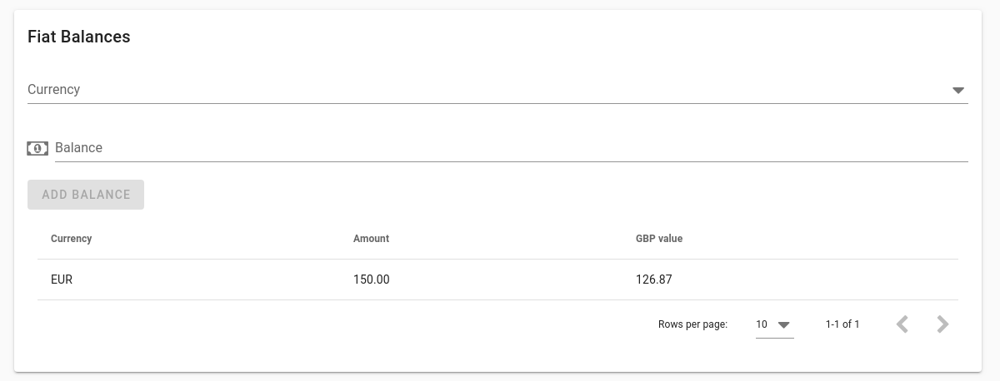

Rotki Usage Guide
#####################
.. toctree::
  :maxdepth: 2

Introduction
*************

In this section we are going to see how to use various parts of the Rotki application.

Sign-in/Signup
===============

When you start Rotki you are greeted with a sign-in/signup prompt.

.. image:: images/sc_newacc1.png
   :alt: Creating a new account
   :align: center

If you have never created an account before press "Create New Account". Provide a username and a password. Don't forget this password. It will be used to encrypt all your local files. The username is just an identifier for your database. It's a local user.

.. image:: images/sc_newacc2.png
   :alt: Creating a new account with a premium Rotki API key/secret pair
   :align: center

If you have purchased a premium subscription you can also add the API Key and the secret here. This will essentially populate the new account with the data saved in the server for your premium subscription. Important thing to note here is that the password of the new account must be the same as the data saved in the server. If not, opening the database will fail.

If you already have an account just write the name and the password at the sign in prompt.

All accounts are created in the rotki directory which is located in: ``$HOME/.rotkehlchen``. Each user has their own subdirectory.

Customizing
**************

This section contains information about how to customize the application through the settings.

.. _change_profit_currency:

Changing the Profit Currency
=============================

Rotki calculates everything, including your profit/loss for your tax report into a given FIAT currency. This is what we call the ``profit_currency``. By default this is USD. You can easily change this setting by clicking on the currency icon the top right menu and changing it to the currency you are using.

.. image:: images/profit_currency.gif
   :alt: Changing the profit currency
   :align: center

Customizing the application settings
====================================

By clicking on the user icon on the top right and choosing settings you can customize some basic settings for the application.

.. image:: images/sc_settings.png
   :alt: Customizing the app settings
   :align: center

Floating precision
--------------------

Set how many decimal points should be shown in the UI for floating point numbers.

Anonymized logs
------------------

Specify whether logging functionality should be anonymized. That has a small cost in performance but makes sure that all logs that would otherwise contain sensitive tradeinformation have them anonymized with random values.

Anonymous usage analytics
-------------------------------

Specify whether the application is allowed to submit anonymous usage analytics. As a local application Rotki has no other way to measure how many active users it has other than submitting some form of analytics. The data that are submitted are completely anonymized and contain no sensitive information.

Date from when to count historical data
-----------------------------------------

A date before which historical data is not counted.

Main currency
----------------

Same as `changing the profit currency <change_profit_currency_>`_.

Connecting to an Ethereum Client
------------------------------------

When Rotki begins it tries to connect to a local ethereum node running with an rpc port set at the default port ``8545``. If no client is running then all blockchain queries will use an external service such as etherscan and this will be rather slower.

If you want to connect to another ethereum client you can set the URL and port through the settings. Click the person icon on the top right menu and select "Settings" from the drop down menu. This will take you to the settings page. Write the desired url/port in the ETH RPC endpoing textbox.

Balance data saving frequency
---------------------------------

Set how often (in hours) the data of all balances will be saved. This data is used to calculate statistics and other historical data to show to the user.

Date display format
---------------------

Set the display format of the dates in the Rotki user interface.

Customizing the accounting settings
====================================

By clicking on the user icon on the top right and choosing accounting settings you can customize some the settings that are used when calculating profit/loss for all your actions.

You should understand what each setting does, consult with a tax accountant for your jurisdcition and then set them appropriately.

The default settings are at the moment set for the German tax jurisdiction. For example all profit/loss calculation is done for trades on a first-in/first-out basis and profits from selling crypto assets after 1 year are non taxable. These settings can be adjusted.

.. image:: images/sc_accounting_settings.png
   :alt: Customizing the accounting settings
   :align: center

Crypto to crypto trades
------------------------

Specify whether crypto to crypto trades are taxable and should be taken into account. If yes then each crypto to crypto trade also creates a "virtual" trade that sells or buys the crypto asset for FIAT and then sells or buys the FIAT for the other crypto asset.

Ethereum gas costs
---------------------

Specify whether ethereum transaction gas costs should be counted as loss. If this is set then all ETH spent on gas will be deducted from your profits and count as an expense.

Tax free period
-------------------

Specify whether there is a period of time and if yes how many days, after which holding a crypto asset is considered not taxable.

Ignored assets
-----------------

Specify which assets you own and would like to completely ignore from all calculations. Any actions that involve these assets are ignored.

Importing data
*******************

In this section we will explain how you can import data by integrating with external services such as crypto exchanges

Adding an exchange
=====================

.. image:: images/add_exchange.gif
   :alt: Add API keys for a new exchange
   :align: center

You can integrate many different exchanges with Rotki. Currently supported exchanges are: Kraken, Poloniex, Bittrex, Bitmex, Binance, Coinbase and Coinbase Pro.

To do so you have to go to your exchange and create an API key. If the exchange allows it make sure that the API Key only has reading/querying permissions to your account and nothing else since that is all the permissions needed by Rotki.

Click on the "API keys" on the left sidebar. This will take you to the place where you can add new exchange API keys. Select your exchange from the dropdown menu. Then copy and paste the ``API Key`` and the ``API Secret`` in the respective text fields and press submit.

If all went well, then you will get a confirmation that the connection was successful. If not please doublecheck that the key and secret are correct.

Adding an external service API Key
=====================================

Rotki relies on various external services for data such as historical crypto prices or ethereum transactions. To get that data some of these services require API keys. So you should go to their webpage, create a free account and generate an API key. Once this is done you can enter the API key in the respective UI element.

.. image:: images/add_external_service.gif
   :alt: Add API keys for an external service
   :align: center

At the moment the only compulsory API key is etherscan. If you don't already have an account with them please create one `here <https://etherscan.io/register>`_ and then generate a free API key and set it in the app as explained above.

Cointracking.info
====================

You can also import data from `cointracking.info <https://cointracking.info/>`_ into Rotki by clicking on "Import Data" on the left sidebard and then following the instructions.

Rotki can import any trade CSV data exported from cointracking.info. But in general it's not recommended to utilize cointracking as their exported data are missing a lot of information.

.. image:: images/sc_data_import.png
   :alt: Importing data from cointracking.info
   :align: center

Tracking accounts and balances
**********************************

To track blockchain accounts&balances and also FIAT balances you need to visit the "Accounts/balances" section from the left sidebar.

Adding Fiat Balances
=====================

Rotki is an asset analytics application. Thus you can track all your assets in one place including the FIAT balances you have.

To add or modify the amount of an owned FIAT currency scroll down to the "Fiat Balances" section and choose the currency from the dropdown menu. Input the modified balance in the text box and press the Modify button.

Adding and Removing Blockchain Accounts
============================================

Rotki allows to track balances of blockchain accounts.

To track an account scroll down to the "Blockchain Balances" section and choose the blockchain from the dropdown menu. For now only Bitcoin and Ethereum chains are supported. Then type or paste the address in the "Account" textbox and press the "Add" Button.

.. image:: images/sc_blockchain_balances.png
   :alt: Add a blockchain account
   :align: center

To stop tracking a particular account scroll down to the accounts tables and simply right click on the account you want to stop tracking and select "Delete" from the context menu.

If an ethereum account also owns tracked tokens you can click on the arrow under "Actions" in order to expand its view and show the balance breakdown for the account over all assets it holds.

Adding and Removing Ethereum Tokens
=========================================

Rotki will autodetect what tokens you have in your ethereum accounts thanks to Alethio. If the query to alethio fails for some reason then you can provide a list of tokens to be tracked and whose balances to query your ethereum node or etherscan for. This list can be provided and modified by you.

To do so scroll down to the "Blockchain Balances" section and look for the "Owned Tokens" fields.

In order to add a token to the tracked tokens start typing its name and the auto-completion of the widget should show it to you. If it does not it may mean that it's not supported by Rotki. Try to make an issue in our github repository to add it.

In order to stop tracking a token simply click the [X] next to the token's name from the list of owned tokens.

All account balances will be updated after addition or removal of tokens.

Adding/Editing Labels and tags
==============================

You can edit any of your blockchain accounts and add a label. The label is unique to the account and will show up in the accounts tables instead of the address. You will still be able to see the address if you hover over the label in the tables.

.. image:: images/add_tag_label.gif
   :alt: Add a label and create a tag
   :align: center

By pressing the edit button for the account you can also add tags to the blockchain account. If you want to create a new tag or edit an existing one you can open the tag manager and choose the name, description and colors of the tag.

Filtering by tags
=====================

You can filter the tables by a combination of tags.

.. image:: images/filter_by_tag.gif
   :alt: Filter the accounts by tag
   :align: center

Simply add the tags you wish to filter by in the filter textbox above the tables.

Manually adding trades or other events
*******************************************

Rotki will pull all your trade history from the exchanges whenever it needs it. But most of us have probably also done some OTC trades or taxable events at some point. Such events could even just be mining tokens, depending on your jurisdiction, participating in an ICO or getting paid in crypto.

On the left sidebar click on the trades button and select "OTC Trades" from the dropdown menu. This will take you to the OTC Trades page.

.. image:: images/sc_add_external_trade.png
   :alt: Add an external trade
   :align: center

To add a new trade or taxable event, fill in all the fields and press the "Add Trade" button.

Some very important things to note. All pairs should be in the form of ``BASECURRENCY_QUOTECURRENCY``. For a ``buy`` this means you are buying ``amount`` of the ``BASE`` currency at a price of ``rate`` ``QUOTE`` currency per ``BASE``. For a ``sell`` this means you are selling ``amount`` of the ``BASE`` currency at a price of ``rate`` ``QUOTE`` currency per ``BASE``.

If there was a fee for the trade you should input it in the corresponding box and also enter the currency the fee was paid in. Fee can also be 0.

You can optionally provide additional notes or even links to blockchain explorers for each trade.

At the bottom of this page you can see a table of all your OTC trades. You can edit or delete a trade by clicking on the appropriate icon at the rightmost part of each trade under the "Actions" column.

Decentralized Finance
**********************

To track and analyze your DeFi actions use the Decentralized Finance tab from the left side menu. You can choose from the different types of DeFi actions presented in the submenu.

Loans
=======

In the loans section you can see the status of your DAI in the DAI Savings Rate (DSR). The accounts that use DSR are auto-detected from your given blockchain accounts. You can see how much DAI you have locked over all of your accounts and how much DAI is locked for each account in the DSR.

.. image:: images/sc_dsr_premium_all.png
   :alt: DSR with premium
   :align: center

If you have a premium subscription you can also see how much DAI you have gained in total or over each account. You can also see your deposits/withdrawals and how much DAI was earned until that point.

.. image:: images/sc_dsr_premium_account.png
   :alt: DSR with premium per account
   :align: center

You can also filter by account and see how much DAI is locked in the DSR for each account or how much DAI was earned for each account.

.. image:: images/sc_dsr_nonpremium_all.png
   :alt: DSR without premium
   :align: center

If you don't have a premium subscription you can't see how much DAI was earned and you also can't see the history of deposits/withdrawals.

.. image:: images/sc_dsr_nonpremium_account.png
   :alt: DSR without premium per account
   :align: center

Without a premium subscription you also can't see the amount of DAI earned per account.

Finally you need to have premium in order for the total amount of DAI earned in a given time period to be counted in the profit/loss statements of the tax report.

Creating a tax report
**********************

Rotki creates a tax report for you based on your trades and the provided accounting settings. This is essentially a calculation of profit or loss for all your trades based on the given dates.

To create a tax report click on the "Tax Report" button from the left menu. Choose a start and an end date for the report and then click the "Generate Report" button.

The calculation may take some time. Once done you have an overview of the profit/loss for the given period, how much of that is taxable, and how much each taxable event category contributes to the total.

Additionally below the overview you get a table containing all of the taxable events that were taken into account in the calculation along with how much of the ``profit_currency`` you lost or gained through that event.

Finally you can get a nice CSV export by pressing the "Export CSV" button. This export is meant to be imported into google sheets. Press the button and then choose a directory to write the CSV files to. Once done you can import the CSV files into google sheets via its import menu.

Analytics
**********

If you have a premium subscription you can get analytics on your all your assets and trades.

Click on the analytics page on the left sidebar to go to your analytics page.

Since Rotki is tracking all your assets over time the first thing you can see is a value/time graph of your entire net value.

.. image:: images/sc_stats_netvalue.png
   :alt: Netvalue over time graph
   :align: center

Following that you can see a graph of quantity of an asset superimposed on its USD value over time.

.. image:: images/sc_stats_asset_amount_value.png
   :alt: Asset amount and value over time
   :align: center

Furthermore you can see a piechart of the distribution of your netvalue across different locations. So you can determine how exposed you are to having a big part of your net value in exchanges, in banks e.t.c.

.. image:: images/sc_stats_distribution_location.png
   :alt: Distribution of networth by location
   :align: center

Finally you can see a piechart of the distribution of your netvalue across all of the assets you own. This is an important analytics tool as it can help you determine your exposure on each asset and if some rebalancing of your portfolio is in order.

.. image:: images/sc_stats_distribution_asset.png
   :alt: Distribution of networth by asset
   :align: center

Set the backend's arguments
*******************************

Rotki runs a python daemon on the backend. Most times you won't need to customize its arguments but if you need to do so, especially for debugging purposes this is how you can.

Create or edit if it exists a file with the name ``rotki_config.json`` in the same directory as the rotki executable. Add to the json object any arguments that are also arguments of rotki. Then when rotki starts these will be passed as arguments to the backend. An example ``rotki_config.json`` follows::

  {
      "loglevel": "debug",
      "logfromothermodules": false,
      "logile": "filenameforthelogs",
      "data-dir": "/path/to/dir"
      "sleep-secs": 20
  }

The above arguments are:

- **loglevel**: Set the loglevel for the application. Valid values are: ``'debug', 'info', 'warn', 'error', 'critical'``.
- **logfromothermodules**: If this argument appears then logging will also include log entries from other dependent libraries and not only rotki. Default is ``false``.
- **logfile**: The name for the logfile. Default is: ``rotkehlchen.log``.
- **data-dir**: The path to the directory where all rotki data will be saved. Default is ``/home/$USER/.rotkehlchen``.
- **sleep-secs**: This is the amount of seconds that the main loop of rotki sleeps for. Default is 20.
